# Ansible Configuration Management — Automate Projects 7 to 10


## Table of Contents

- [Project Overview](#project-overview)
- [Architecture](#architecture)
- [Prerequisites](#prerequisites)
- [Technologies Used](#technologies-used)
- [Infrastructure Setup (AWS)](#infrastructure-setup-aws)
  - [VPC and Networking](#vpc-and-networking)
  - [EC2 Instances](#ec2-instances)
  - [Elastic IP for Jenkins-Ansible](#elastic-ip-for-jenkins-ansible)
- [Step 1 — Install and Configure Ansible on EC2 Instance](#step-1--install-and-configure-ansible-on-ec2-instance)
  - [Install Java](#install-java)
  - [Install Jenkins](#install-jenkins)
  - [Install Ansible](#install-ansible)
- [Step 2 — Configure Jenkins](#step-2--configure-jenkins)
  - [Create a Freestyle Project in Jenkins](#create-a-freestyle-project-in-jenkins)
  - [Configure GitHub Webhook](#configure-github-webhook)
  - [Configure Post-Build Actions](#configure-post-build-actions)
  - [Verify Jenkins Build Artifacts](#verify-jenkins-build-artifacts)
- [Step 3 — Prepare Development Environment (VS Code)](#step-3--prepare-development-environment-vs-code)
  - [Clone the Repository](#clone-the-repository)
- [Step 4 — Begin Ansible Development](#step-4--begin-ansible-development)
  - [Repository Structure](#repository-structure)
  - [Create Feature Branch](#create-feature-branch)
- [Step 5 — Set Up Ansible Inventory](#step-5--set-up-ansible-inventory)
  - [Configure SSH Agent](#configure-ssh-agent)
  - [Inventory File (dev)](#inventory-file-dev)
- [Step 6 — Create the Common Playbook](#step-6--create-the-common-playbook)
- [Step 7 — Update Git and Raise a Pull Request](#step-7--update-git-and-raise-a-pull-request)
- [Step 8 — Run the First Ansible Test](#step-8--run-the-first-ansible-test)
  - [Ping All Hosts](#ping-all-hosts)
  - [Execute the Playbook](#execute-the-playbook)
  - [Verify Wireshark Installation](#verify-wireshark-installation)
- [Project Files](#project-files)
- [Lessons Learned](#lessons-learned)
- [References](#references)

---

## Project Overview

This project demonstrates the power of **Ansible Configuration Management** by automating tasks that were previously performed manually in Projects 7–10. Instead of manually SSH-ing into each server to install software, update configurations, and deploy applications, this project uses **Ansible Playbooks** to perform all these operations automatically across multiple servers with a single command.

Key accomplishments:
- Configured a **Jenkins-Ansible** server as a **Jump Server / Bastion Host**
- Automated Jenkins builds triggered by GitHub webhooks
- Wrote reusable Ansible playbooks using **YAML** (a declarative language)
- Managed a multi-server infrastructure (NFS, Web Servers, DB, Load Balancer) from a single control node

---

## Architecture

```
Internet
    |
    ▼
[Jenkins-Ansible Server]  ← Bastion / Jump Host (Public Subnet)
    |         |        |         |
    ▼         ▼        ▼         ▼
[Web1]    [Web2]    [NFS]    [DB Server]   ← Private Subnet
                                |
                          [Load Balancer]  ← Public Subnet
```

The **Jenkins-Ansible** server sits in the public subnet and acts as the single entry point. It:
1. Receives code changes from GitHub (via webhook)
2. Jenkins archives build artifacts
3. Ansible uses those artifacts to configure all other servers via SSH

---

## Prerequisites

Before starting this project, ensure you have:

- An **AWS account** with IAM permissions to create VPCs, EC2 instances, and Elastic IPs
- A **GitHub account** with a repository named `ansible-config-mgt`
- **Visual Studio Code** installed locally with the Remote-SSH extension
- Basic knowledge of Linux command line, Git, and YAML
- An existing key pair (`.pem` file) for SSH access to EC2 instances

---

## Technologies Used

| Tool | Purpose |
|------|---------|
| **AWS EC2** | Virtual servers (Jenkins-Ansible, Web Servers, NFS, DB, LB) |
| **AWS VPC** | Isolated network environment |
| **Ansible** | Configuration management and automation |
| **Jenkins** | CI/CD — automates build and artifact archiving |
| **GitHub** | Source code management and webhook trigger |
| **Ubuntu 22.04 LTS** | OS for all EC2 instances |
| **YAML** | Playbook language for Ansible |
| **VS Code** | IDE with Remote-SSH for development |

---

## Infrastructure Setup (AWS)

### VPC and Networking

A custom **VPC** was created to host all project resources in an isolated network.

**1. Create the VPC**

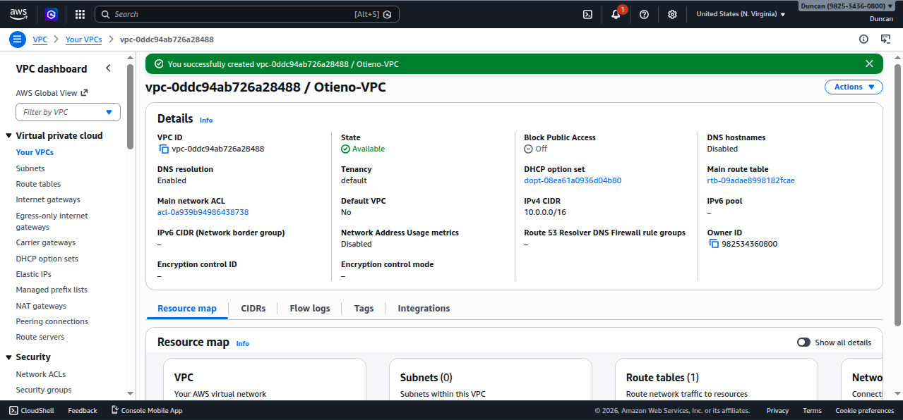

- Navigate to **VPC → Your VPCs → Create VPC**
- Name: `ansible-vpc`
- IPv4 CIDR block: `10.0.0.0/16`

**2. Create an Internet Gateway and Attach to VPC**

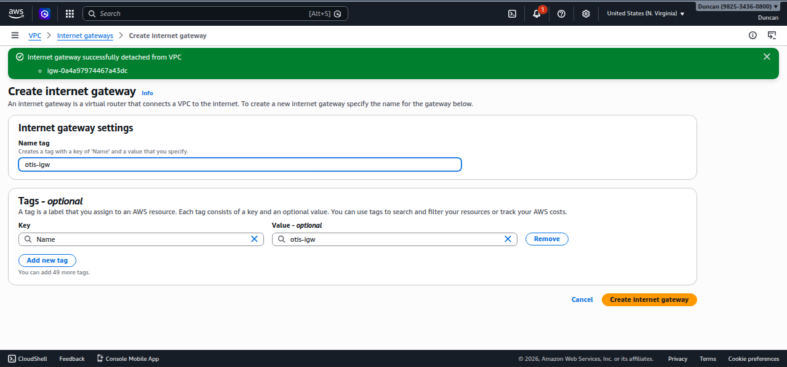
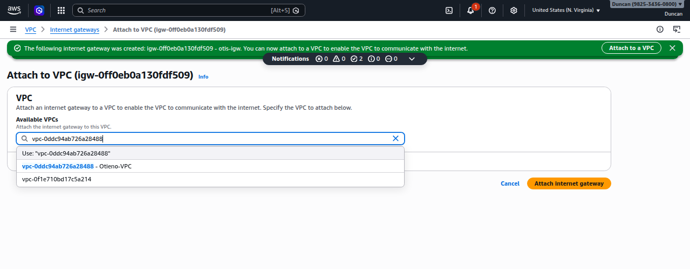

- Navigate to **Internet Gateways → Create Internet Gateway**
- Attach it to `ansible-vpc`

**3. Create Public and Private Subnets**

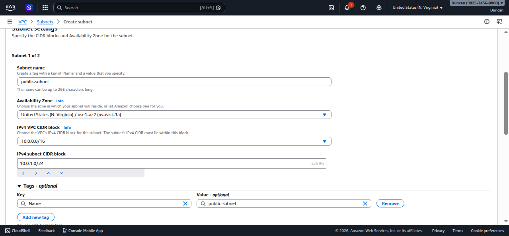
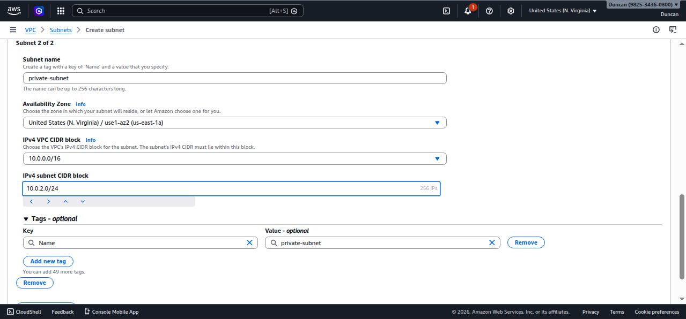

| Subnet | CIDR | Type |
|--------|------|------|
| `ansible-public-subnet` | `10.0.1.0/24` | Public |
| `ansible-private-subnet` | `10.0.2.0/24` | Private |

**4. Create and Configure Route Tables**

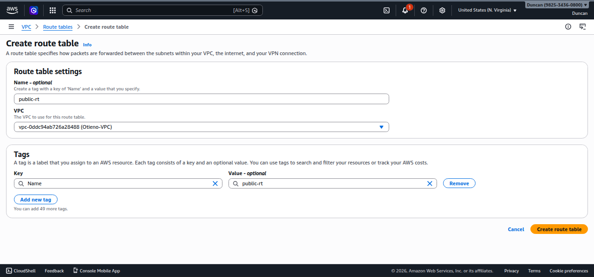
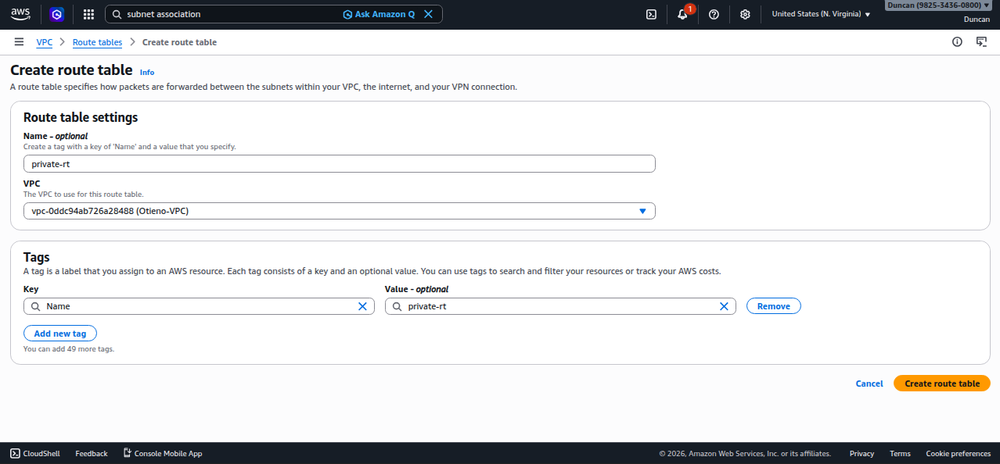
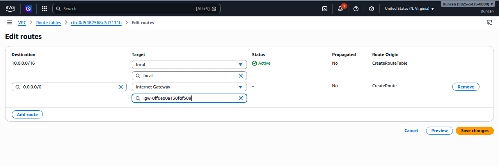
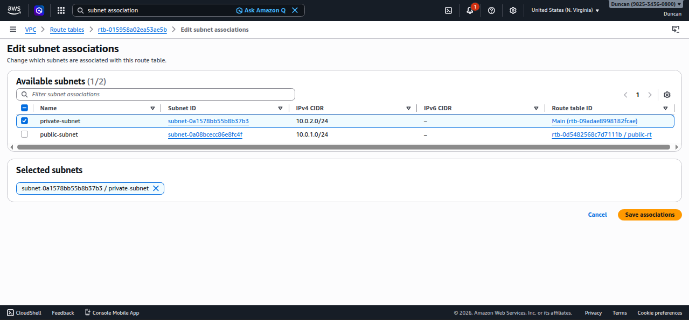

- Public route table: Add a route `0.0.0.0/0 → Internet Gateway`
- Associate the public subnet with the public route table
- Associate the private subnet with the private route table (no internet route)

---

### EC2 Instances

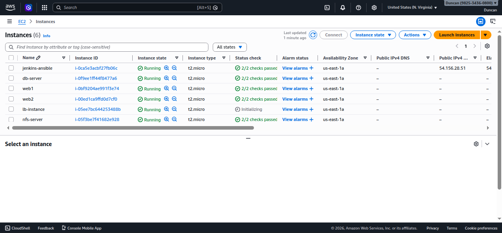

Launch the following EC2 instances, all using **Ubuntu 22.04 LTS** AMI:

| Server | Name | Subnet | Notes |
|--------|------|--------|-------|
| Jenkins-Ansible | `Jenkins-Ansible` | Public | Control node + Jump server |
| Web Server 1 | `Web-Server1` | Private | Managed node |
| Web Server 2 | `Web-Server2` | Private | Managed node |
| NFS Server | `NFS-Server` | Private | Managed node |
| Database Server | `DB-Server` | Private | Managed node |
| Load Balancer | `Load-Balancer` | Public | Managed node |

> **Security Groups:** Ensure the Jenkins-Ansible server allows inbound traffic on ports **22** (SSH), **8080** (Jenkins), and **ICMP** (ping). Private instances should only allow SSH from the Jenkins-Ansible server's private IP.

---

### Elastic IP for Jenkins-Ansible

Every time you stop/start an EC2 instance, its public IP changes — which would break your GitHub webhook. Allocate a static **Elastic IP** to avoid this.


```
EC2 Dashboard → Elastic IPs → Allocate Elastic IP → Associate to Jenkins-Ansible instance
```

> ⚠️ **Important:** Elastic IPs are free only when associated with a running instance. Release the Elastic IP when you terminate your instance to avoid charges.

---

## Step 1 — Install and Configure Ansible on EC2 Instance

SSH into your **Jenkins-Ansible** server:

```bash
ssh -i <your-key.pem> ubuntu@<Jenkins-Ansible-Public-IP>
```

### Install Java

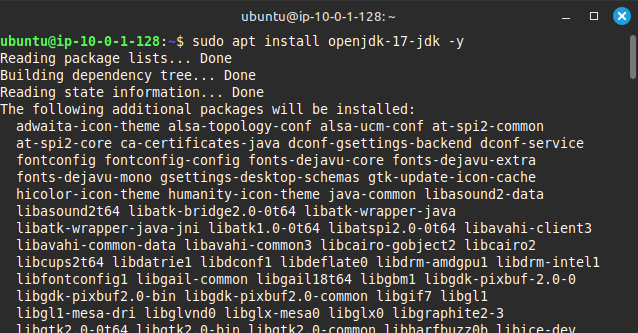

Java is required before installing Jenkins:

```bash
sudo apt update
sudo apt install fontconfig openjdk-17-jre -y
java -version
```

### Install Jenkins

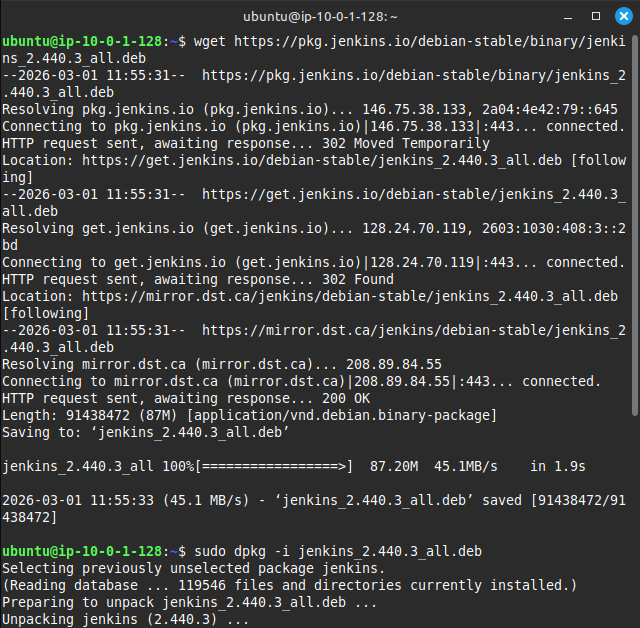
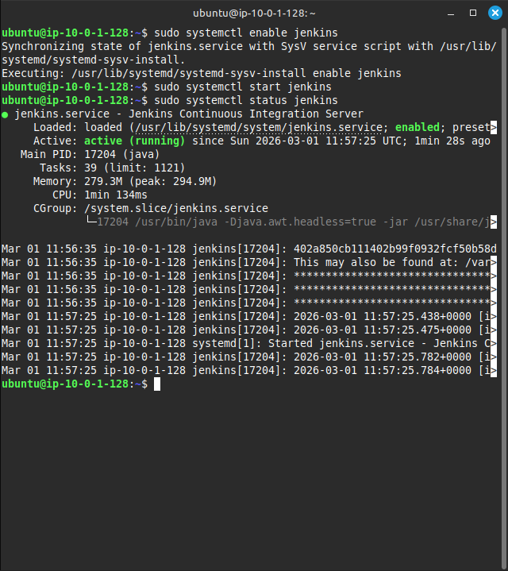

```bash
# Add Jenkins repository key and source
sudo wget -O /usr/share/keyrings/jenkins-keyring.asc \
  https://pkg.jenkins.io/debian-stable/jenkins.io-2023.key

echo "deb [signed-by=/usr/share/keyrings/jenkins-keyring.asc]" \
  https://pkg.jenkins.io/debian-stable binary/ | sudo tee \
  /etc/apt/sources.list.d/jenkins.list > /dev/null

sudo apt-get update
sudo apt-get install jenkins -y

# Start and enable Jenkins
sudo systemctl start jenkins
sudo systemctl enable jenkins
sudo systemctl status jenkins
```

Access Jenkins at: `http://<Jenkins-Ansible-Public-IP>:8080`

Retrieve the initial admin password:
```bash
sudo cat /var/lib/jenkins/secrets/initialAdminPassword
```

### Install Ansible

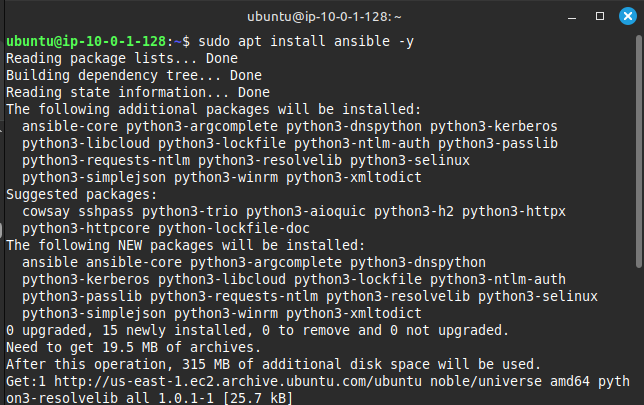

```bash
sudo apt update
sudo apt install ansible -y

# Verify installation
ansible --version
```

---

## Step 2 — Configure Jenkins

### Create a Freestyle Project in Jenkins

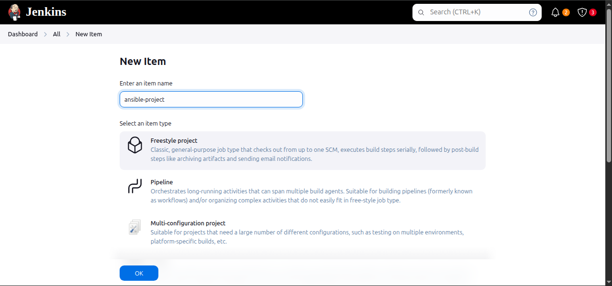
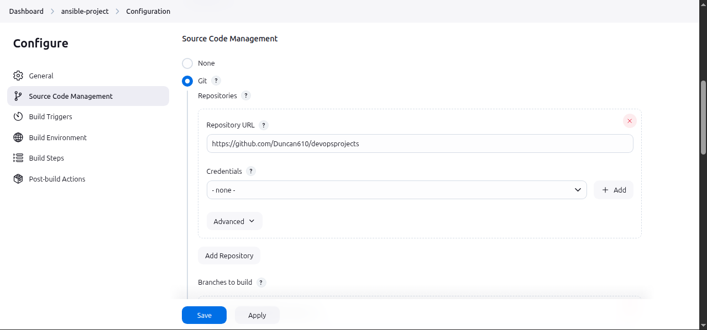

1. Open Jenkins at `http://<Jenkins-Ansible-Public-IP>:8080`
2. Click **New Item** → name it `ansible` → select **Freestyle project** → OK
3. Under **Source Code Management**, select **Git**
4. Enter your repository URL: `https://github.com/<your-username>/ansible-config-mgt.git`
5. Set the branch to `*/main` (or `*/master`)
6. Add your GitHub credentials if the repo is private

### Configure GitHub Webhook

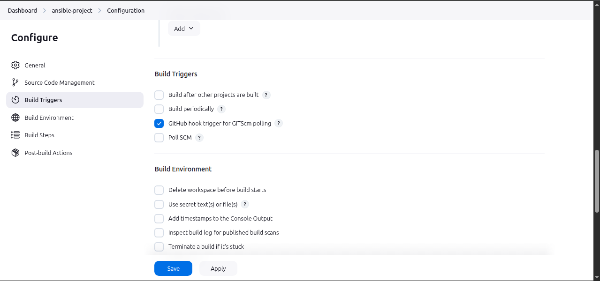

In Jenkins project configuration, under **Build Triggers**:
- Check **GitHub hook trigger for GITScm polling**

In your **GitHub repository**:
1. Go to **Settings → Webhooks → Add webhook**
2. Payload URL: `http://<Jenkins-Ansible-Elastic-IP>:8080/github-webhook/`
3. Content type: `application/json`
4. Event: **Just the push event**
5. Click **Add webhook**

### Configure Post-Build Actions

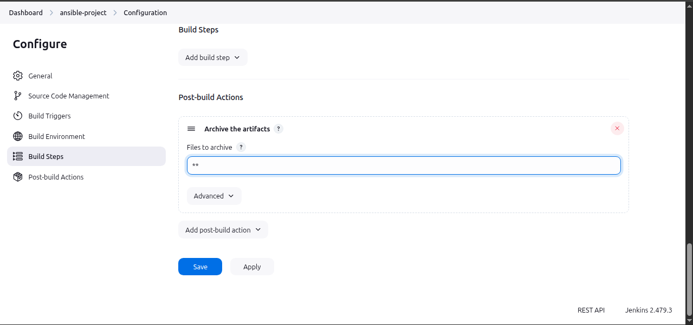

Under **Post-build Actions**:
1. Click **Add post-build action → Archive the artifacts**
2. In **Files to archive**, enter: `**`
3. Save the configuration

### Verify Jenkins Build Artifacts

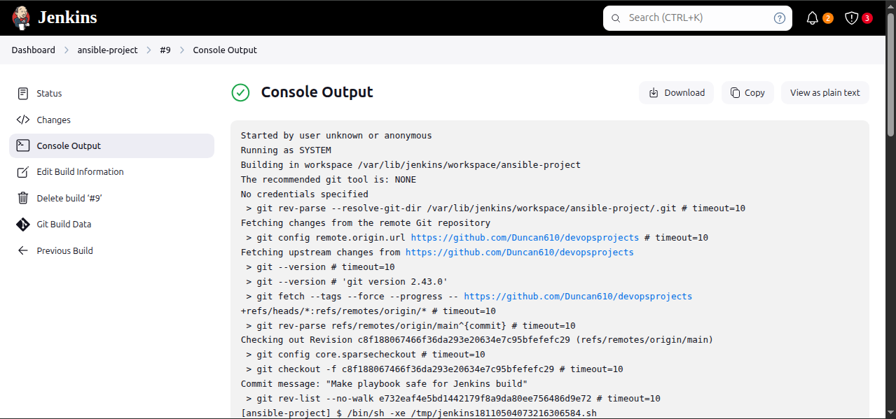
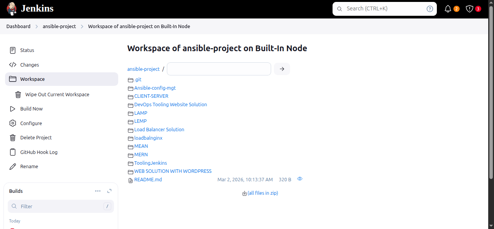

Test by making a change to `README.md` in your repository. Jenkins should automatically trigger a build. Verify artifacts are saved:

```bash
ls /var/lib/jenkins/jobs/ansible/builds/<build_number>/archive/
```

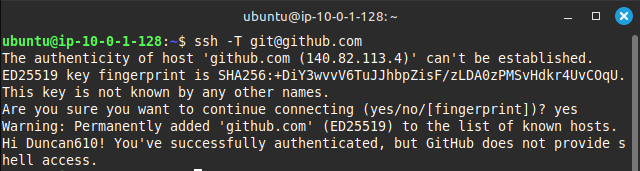

---

## Step 3 — Prepare Development Environment (VS Code)

1. Install [Visual Studio Code](https://code.visualstudio.com/)
2. Install the **Remote - SSH** extension
3. Configure SSH connection to your Jenkins-Ansible server in `~/.ssh/config`:

```
Host jenkins-ansible
    HostName <Jenkins-Ansible-Elastic-IP>
    User ubuntu
    IdentityFile <path-to-your-key.pem>
```

4. Open VS Code → **Remote Explorer** → Connect to `jenkins-ansible`

### Clone the Repository

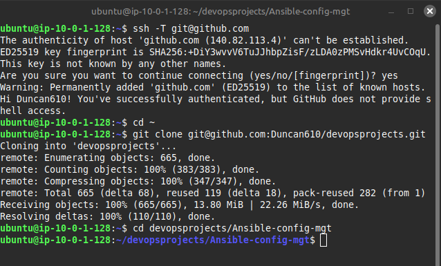

```bash
git clone https://github.com/<your-username>/ansible-config-mgt.git
cd ansible-config-mgt
```

---

## Step 4 — Begin Ansible Development

### Repository Structure

```
ansible-config-mgt/
│
├── Inventory/
│   └── dev          # Inventory for development environment
├── playbooks/
│   └── common.yml   # Common playbook for all servers
├── images/          # Screenshots for documentation
└── README.md
```

### Create Feature Branch

Follow GitFlow best practices — never commit directly to `main`:

```bash
# Create and switch to a new feature branch
git checkout -b feature/prj-001-ansible-config

# Verify you're on the new branch
git branch
```

Create the required directories and files:

```bash
mkdir playbooks inventory
touch playbooks/common.yml
touch inventory/dev
```

---

## Step 5 — Set Up Ansible Inventory

### Configure SSH Agent

Ansible needs to SSH into target servers from the Jenkins-Ansible host. Use **ssh-agent** to forward your key:

```bash
# Start ssh-agent
eval `ssh-agent -s`

# Add your private key
ssh-add <path-to-private-key.pem>

# Confirm the key has been added
ssh-add -l
```

SSH into Jenkins-Ansible with agent forwarding enabled:

```bash
ssh -A ubuntu@<Jenkins-Ansible-Elastic-IP>
```

> ✅ The `-A` flag enables SSH agent forwarding, allowing Ansible on the Jenkins-Ansible server to reach private instances using your local key — without copying the key file to the server.

### Inventory File (dev)

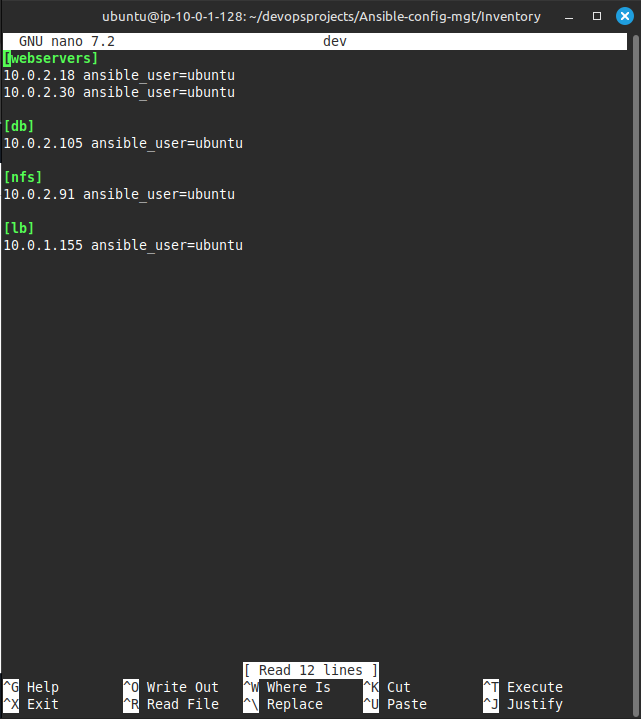

Update `Inventory/dev` with your actual private IP addresses:

```ini
[nfs]
<NFS-Server-Private-IP> ansible_ssh_user=ubuntu

[webservers]
<Web-Server1-Private-IP> ansible_ssh_user=ubuntu
<Web-Server2-Private-IP> ansible_ssh_user=ubuntu

[db]
<Database-Private-IP> ansible_ssh_user=ubuntu

[lb]
<Load-Balancer-Private-IP> ansible_ssh_user=ubuntu
```

> 📝 **Note:** Since all servers use Ubuntu AMI in this setup, `ansible_ssh_user=ubuntu` is used throughout. If you were using RHEL-based servers, the user would be `ec2-user`.

---

## Step 6 — Create the Common Playbook

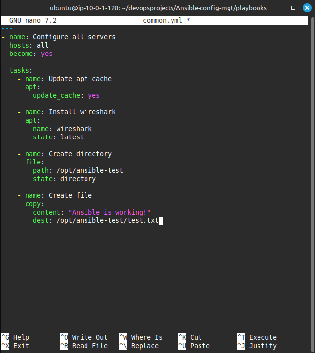

Update `playbooks/common.yml` with the following:

```yaml
---
- name: update web, nfs and db servers
  hosts: webservers, nfs, db
  become: yes
  tasks:
    - name: ensure wireshark is at the latest version
      apt:
        name: wireshark
        state: latest
        update_cache: yes

- name: update LB server
  hosts: lb
  become: yes
  tasks:
    - name: Update apt repo
      apt:
        update_cache: yes

    - name: ensure wireshark is at the latest version
      apt:
        name: wireshark
        state: latest
```

> 📌 Since all servers in this project use **Ubuntu**, the `apt` module is used throughout. The playbook installs/updates **Wireshark** on all managed nodes using root privileges (`become: yes`).

**What this playbook does:**
- Targets all server groups defined in the inventory
- Escalates privileges with `sudo` via `become: yes`
- Uses the `apt` package manager (Ubuntu/Debian)
- Ensures Wireshark is installed and at the latest version
- Updates the apt cache before installation on the LB server

**Optional additional tasks you can add:**

```yaml
    - name: Create a directory
      file:
        path: /home/ubuntu/ansible-demo
        state: directory
        mode: '0755'

    - name: Create a file inside the directory
      file:
        path: /home/ubuntu/ansible-demo/hello.txt
        state: touch

    - name: Set timezone to Africa/Nairobi
      timezone:
        name: Africa/Nairobi
```

---

## Step 7 — Update Git and Raise a Pull Request

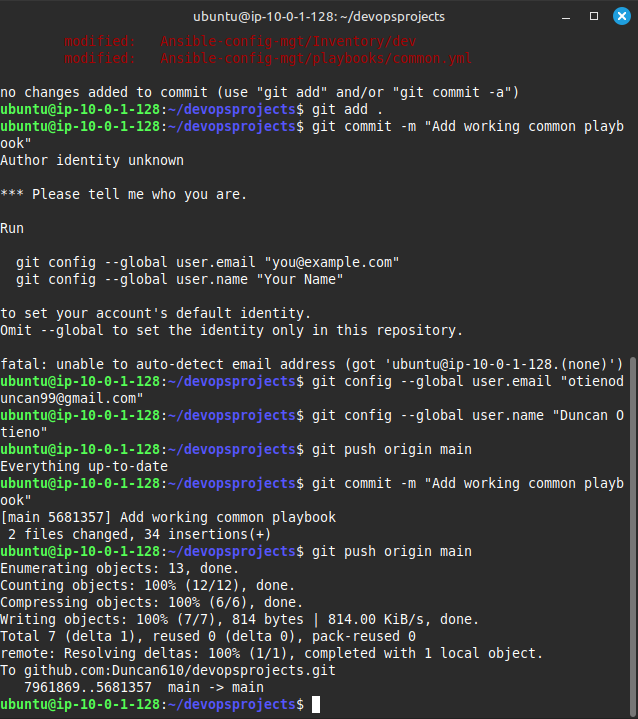

Follow the **Four Eyes Principle** — all code must be reviewed before merging to `main`:

```bash
# Check the status of changes
git status

# Stage all changes
git add .

# Commit with a meaningful message
git commit -m "feat: add common playbook to install wireshark on all servers"

# Push the feature branch to GitHub
git push origin feature/prj-001-ansible-config
```

**Raise a Pull Request on GitHub:**
1. Go to your repository on GitHub
2. Click **Compare & pull request** for your feature branch
3. Add a title and description
4. Request a review (or review it yourself)
5. Click **Merge pull request** once approved
6. Delete the feature branch after merging

**Pull the merged changes locally:**

```bash
git checkout main
git pull origin main
```

Once the code lands in `main`, Jenkins automatically triggers a build and archives the artifacts.

---

## Step 8 — Run the First Ansible Test

Ensure you are connected to your Jenkins-Ansible server with SSH agent forwarding enabled.

### Ping All Hosts

Before running a playbook, verify Ansible can reach all hosts:

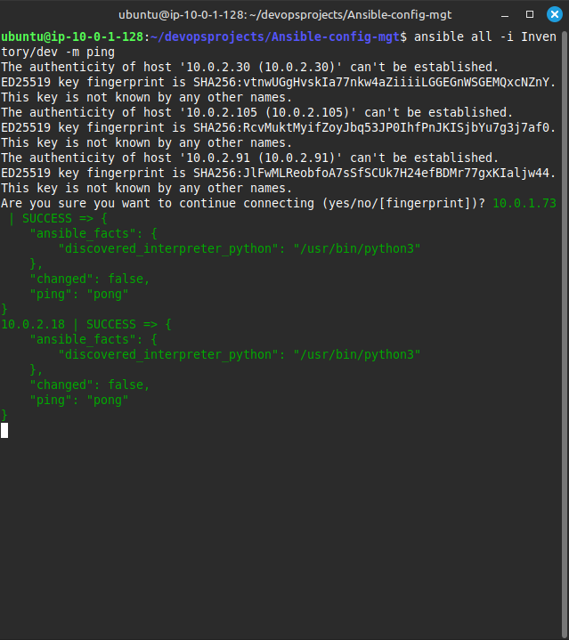
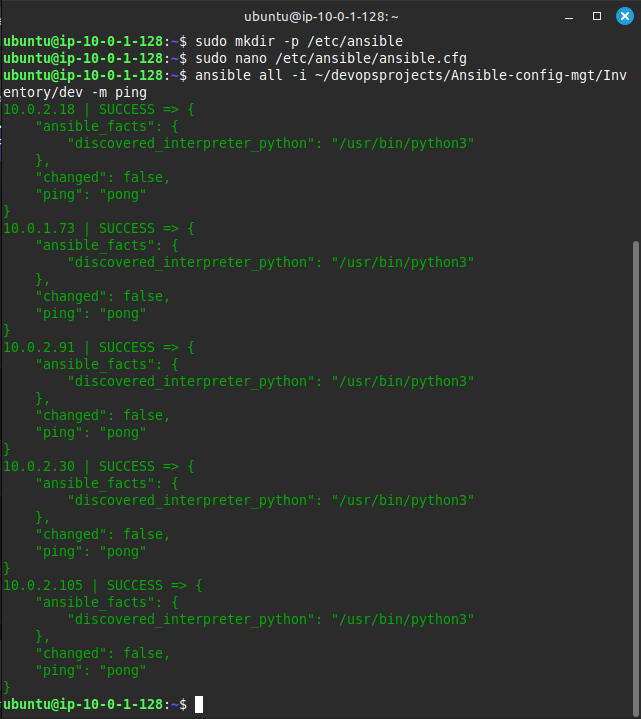

```bash
cd ansible-config-mgt

# Test connectivity to all hosts
ansible all -i Inventory/dev -m ping
```

Expected output for each host:
```
<host-ip> | SUCCESS => {
    "changed": false,
    "ping": "pong"
}
```

### Execute the Playbook

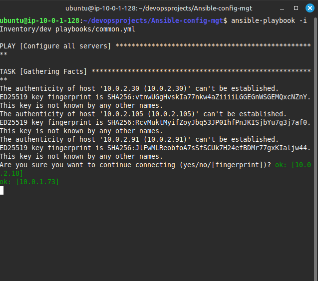

```bash
ansible-playbook -i Inventory/dev playbooks/common.yml
```

You should see output similar to:

```
PLAY [update web, nfs and db servers] ******************************************

TASK [Gathering Facts] *********************************************************
ok: [<web-server-1-ip>]
ok: [<web-server-2-ip>]
ok: [<nfs-server-ip>]
ok: [<db-server-ip>]

TASK [ensure wireshark is at the latest version] *******************************
changed: [<web-server-1-ip>]
changed: [<web-server-2-ip>]
...

PLAY RECAP *********************************************************************
<host-ip>    : ok=2    changed=1    unreachable=0    failed=0
```

### Verify Wireshark Installation

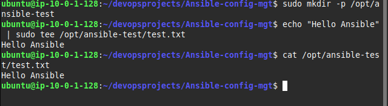

SSH into any of the managed servers and verify:

```bash
which wireshark
# or
wireshark --version
```

---

## Project Files

### `Inventory/dev`

Defines all managed hosts grouped by role:

```ini
[nfs]
<NFS-Server-Private-IP> ansible_ssh_user=ubuntu

[webservers]
<Web-Server1-Private-IP> ansible_ssh_user=ubuntu
<Web-Server2-Private-IP> ansible_ssh_user=ubuntu

[db]
<Database-Private-IP> ansible_ssh_user=ubuntu

[lb]
<Load-Balancer-Private-IP> ansible_ssh_user=ubuntu
```

### `playbooks/common.yml`

Installs and updates Wireshark across all server groups:

```yaml
---
- name: update web, nfs and db servers
  hosts: webservers, nfs, db
  become: yes
  tasks:
    - name: ensure wireshark is at the latest version
      apt:
        name: wireshark
        state: latest
        update_cache: yes

- name: update LB server
  hosts: lb
  become: yes
  tasks:
    - name: Update apt repo
      apt:
        update_cache: yes
    - name: ensure wireshark is at the latest version
      apt:
        name: wireshark
        state: latest
```

---

## Lessons Learned

- **Ansible is agentless** — it only requires SSH access and Python on managed nodes, making setup lightweight
- **Declarative YAML** makes infrastructure-as-code readable and self-documenting
- **SSH agent forwarding** (`ssh -A`) is key to enabling Ansible to reach private subnet servers without storing keys on the bastion host
- **Elastic IPs** prevent webhook misconfigurations caused by changing public IPs on EC2 restarts
- **Jenkins + GitHub webhooks** create a powerful automated pipeline: push code → Jenkins detects it → archives artifacts → Ansible deploys changes
- **Branching and Pull Requests** enforce code quality standards even in solo projects — a habit that scales to team environments
- The **Four Eyes Principle** (peer review before merge) is a real-world DevOps/engineering standard

---

## References

- [Ansible Documentation](https://docs.ansible.com/)
- [Install Ansible with pip](https://docs.ansible.com/ansible/latest/installation_guide/intro_installation.html)
- [Jenkins Documentation](https://www.jenkins.io/doc/)
- [Understanding Ansible Playbooks — RedHat](https://www.redhat.com/en/topics/automation/what-is-an-ansible-playbook)
- [SSH Agent Forwarding — GitHub Docs](https://docs.github.com/en/authentication/connecting-to-github-with-ssh/using-ssh-agent-forwarding)
- [AWS VPC Documentation](https://docs.aws.amazon.com/vpc/latest/userguide/what-is-amazon-vpc.html)

---

> 🚀 **Challenge yourself:** After completing this project, extend the `common.yml` playbook with additional tasks — set up NTP, create users, configure firewall rules, or deploy a web application. The workflow remains the same: edit → commit → PR → merge → Jenkins builds → Ansible deploys.
