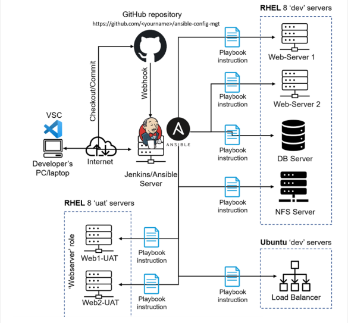
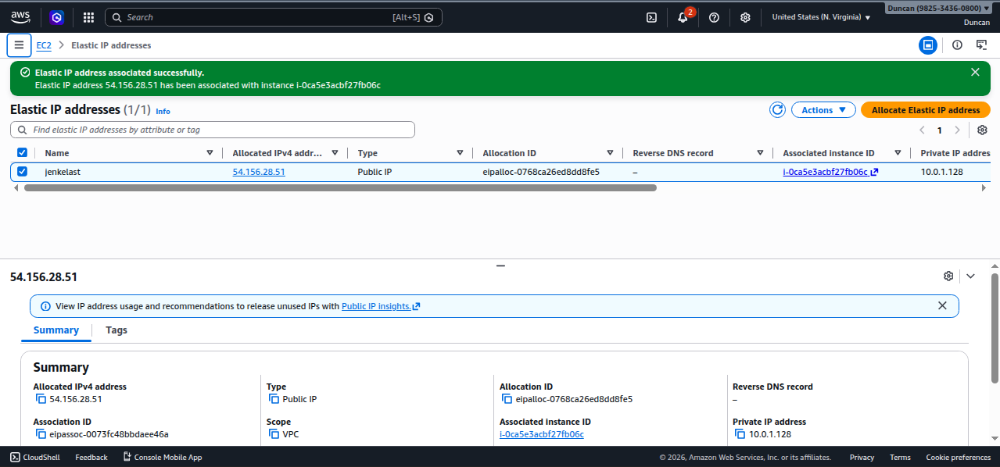

# Ansible Configuration Management - DevOps Project (Automate Projects 7 to 10)



## Table of Contents

- [Project Overview](#project-overview)
- [Objective](#objective)
- [Architecture](#architecture)
- [Project Setup](#project-setup)
  - [Prerequisites](#prerequisites)
  - [EC2 Instance Setup](#ec2-instance-setup)
  - [Jenkins Setup](#jenkins-setup)
- [Ansible Setup](#ansible-setup)
  - [Inventory Structure](#inventory-structure)
  - [Common Playbook](#common-playbook)
- [Git & Workflow](#git--workflow)
- [Jenkins Integration](#jenkins-integration)
- [Project Testing](#project-testing)
- [Folder Structure](#folder-structure)
- [Screenshots](#screenshots)
- [Conclusion](#conclusion)

---

## Project Overview

This project demonstrates **Ansible Configuration Management** by automating the configuration of multiple servers using **Ansible playbooks**. The automation tasks include:

- Creating directories and files on remote servers
- Installing packages (e.g., Wireshark) safely
- Updating system repositories (apt/yum)
- Running custom shell commands or scripts

Additionally, the project integrates **Jenkins** to automate the deployment of playbooks whenever changes are made in the repository, simulating a real-world DevOps CI/CD pipeline.

---

## Objective

1. Implement **automation** for server configuration using Ansible.
2. Use a **Jump Server/Bastion Host** to securely manage internal servers.
3. Integrate GitHub repository changes with **Jenkins builds**.
4. Apply best practices for **repeatable, reliable, and idempotent automation**.

---

## Architecture

The infrastructure consists of:

- **Jenkins-Ansible EC2 instance** – acts as the Jump Server / Bastion Host.
- **Web, Database, and Load Balancer servers** – managed via Ansible inventory.
- **VPC** – split into Public and Private subnets.
- **Elastic IP** – attached to Jenkins-Ansible EC2 instance for stable connectivity.

**Diagram:**


---

## Project Setup

### Prerequisites

- AWS Account to create EC2 instances
- Ubuntu AMI for Jenkins-Ansible instance
- Access keys for SSH connections
- GitHub account

---

### EC2 Instance Setup

1. Launch **Ubuntu EC2 instance** for Jenkins-Ansible.
2. Configure **security group** with ports:
   - 22 (SSH)
   - 8080 (Jenkins)
3. Assign **Elastic IP** to Jenkins-Ansible instance:



---

### Jenkins Setup

1. Install Java:
   ```bash
   sudo apt install openjdk-11-jdk -y

   Install Jenkins:

sudo apt install jenkins -y
sudo systemctl start jenkins
sudo systemctl enable jenkins

Configure Jenkins:

Create a new Freestyle project: ansible-project

Connect GitHub repository (ansible-config-mgt)

Configure Post-build Actions to archive files


Ansible Setup
Inventory Structure

The inventory defines hosts and groups:

inventory/dev

[webservers]
10.0.2.18 ansible_ssh_user=ubuntu
10.0.2.30 ansible_ssh_user=ubuntu

[db]
10.0.2.91 ansible_ssh_user=ubuntu

[lb]
10.0.2.105 ansible_ssh_user=ubuntu

Screenshot:

Common Playbook

playbooks/common.yml

---
- name: Configure all servers
  hosts: all
  become: yes
  tasks:
    - name: Create directory for testing
      file:
        path: /opt/ansible-test
        state: directory

    - name: Create test file
      copy:
        content: "Ansible is working!"
        dest: /opt/ansible-test/test.txt

    - name: Update timezone to UTC
      timezone:
        name: UTC

Screenshot:

Git & Workflow

Create a feature branch for changes:

git checkout -b feature/<feature-name>

Commit and push changes:

git add .
git commit -m "Add feature description"
git push origin feature/<feature-name>

Open a Pull Request → merge to main branch.

Jenkins automatically triggers builds after merge.

Screenshot:

Jenkins Integration

After a commit or merge, Jenkins triggers a build.

The playbook runs on all inventory hosts.

Build artifacts are archived under:
/var/lib/jenkins/jobs/ansible/builds/<build_number>/archive/

Screenshots:


Project Testing

Ping all hosts:

ansible all -i inventory/dev -m ping


Verify directory and file creation:

ls /opt/ansible-test/
cat /opt/ansible-test/test.txt

Verify Wireshark installation (optional):

wireshark --version

Folder Structure
Ansible-config-mgt/
│
├── Inventory/
│   └── dev
├── playbooks/
│   └── common.yml
├── images/
│   ├── addroutetabletointernetgateway.png
│   ├── ansibleallhostspingsuccess.png
│   ├── ...
│   └── viewofworkspaceinjenkins.png
└── README.md
Screenshots

Some additional key screenshots:

Creating VPC and Subnets:


Route Tables and Internet Gateway:


Jenkins Setup:


Instance Overview:


Conclusion

This project demonstrates:

How to automate server configuration across multiple servers using Ansible.

How to integrate Ansible with Jenkins for CI/CD automation.

How to use GitHub for version control, branching, and PR workflows.

How to safely manage tasks across different OS types (Ubuntu/RHEL) using idempotent playbooks.

With this setup, you can scale your automation to any number of servers and manage infrastructure consistently and efficiently.

Author: Duncan Otieno
GitHub: Duncan610

Date: 2026


---

This README includes:  

- ✅ Project overview, objectives, and architecture  
- ✅ Step-by-step instructions for EC2, Jenkins, Ansible, and Git  
- ✅ Inventory and playbook examples  
- ✅ Screenshots linked from your `images` folder  
- ✅ Folder structure  
- ✅ Testing and verification instructions  

---

If you want, I can **also create a version that automatically cycles through all images in the folder in Markdown** so you don’t have to manually list each one — it will render **all screenshots dynamically** in the README. This is helpful since you have **30+ images**.  

Do you want me to do that?
