# Client-Server Architecture with MySQL on AWS  

Implement a basic client-server architecture using MySQL Database Management System (DBMS) with two Linux-based EC2 instances on AWS. One server hosts the MySQL database, while the other connects remotely as a client.

---

## Steps & Screenshots  

### 1. Launching EC2 Instances  
Created two Linux-based EC2 instances: one designated as **MySQL Server** and the other as **MySQL Client**. Both run in the same VPC for internal communication.  
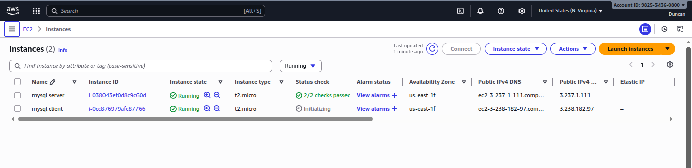  

### 2. Updating & Upgrading Packages  
Ran `sudo apt update && sudo apt upgrade -y` to ensure both instances had the latest packages and security patches.  
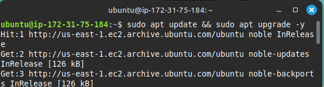  

### 3. Installing MySQL Server (on Server instance)  
Installed MySQL Server software on the **mysql server** instance to host the database engine.  
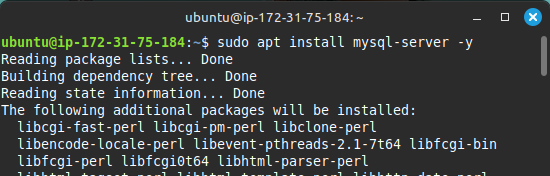  

### 4. Installing MySQL Client (on Client instance)  
Installed MySQL Client tools on the **mysql client** instance to enable remote database connections.  
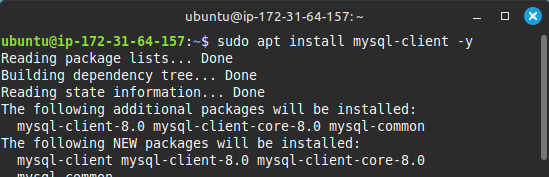  

### 5. Checking MySQL Version  
Verified the installed MySQL version to confirm a successful installation.  
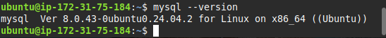  

### 6. Starting MySQL Service  
Started and enabled the MySQL service on the server to allow database connections.  
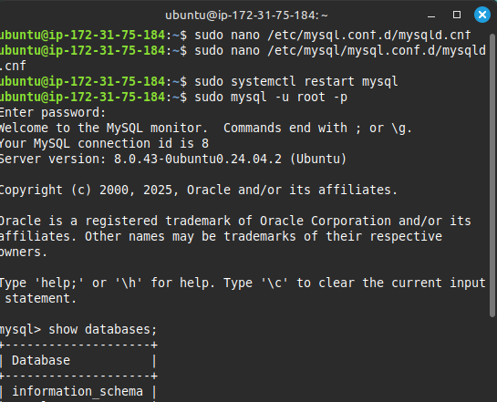  

### 7. Creating Remote User  
Created a **remote MySQL user** with a secure password to allow external access from the client.  
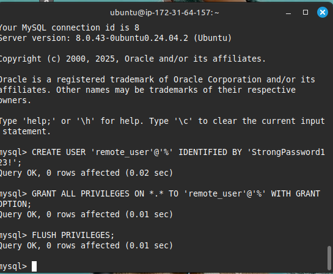  

### 8. Setting User Privileges  
Granted the necessary privileges to the remote user, ensuring they could connect and query the database.  
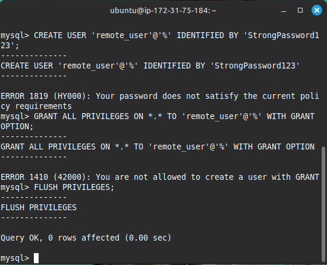  

### 9. Securing MySQL  
Edited MySQL configuration to listen on all IPs (`0.0.0.0`) and tightened access control.  
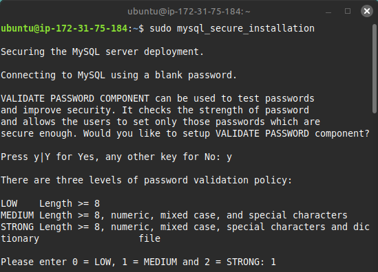  

### 10. Editing Inbound Rules (Server Security Group)  
Configured inbound rules to allow MySQL traffic (TCP/3306) only from the client’s **private IP**, improving security.  
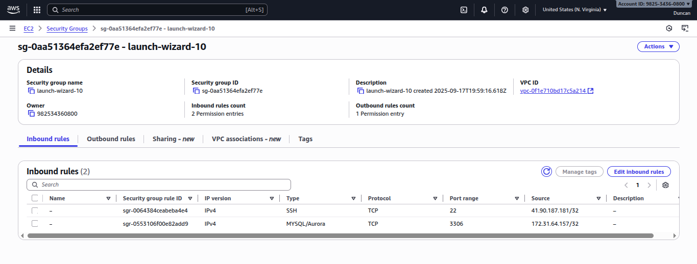  

### 11. Editing Client Inbound Rule (for testing)  
Adjusted inbound rules on the client instance when needed to support communication.  
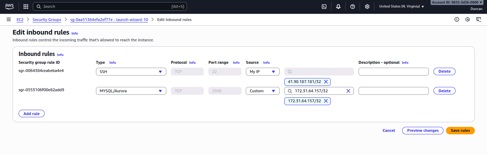  

### 12. SSH into Client Instance  
Logged into the **mysql client** instance using SSH to begin remote connection testing.  
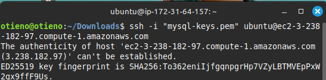  

### 13. Connecting to MySQL Server from Client  
Used the `mysql -u remote_user -p -h <server-private-ip>` command to connect from the client to the server. Connection was successful, and SQL queries executed as expected.  
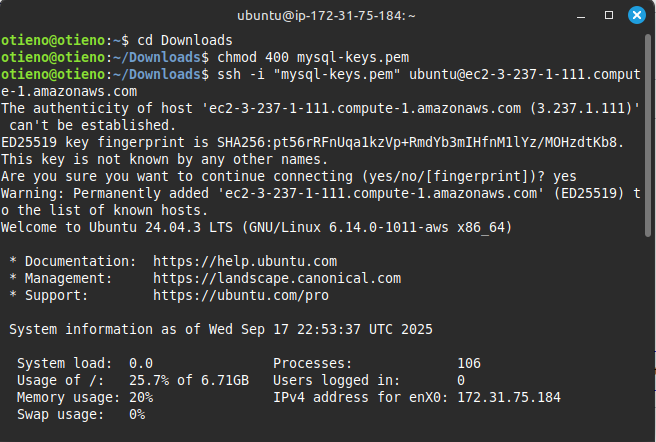  

### 14. Stopping the Instances Safely  
Stopped both EC2 instances after testing to avoid incurring unnecessary AWS charges.  
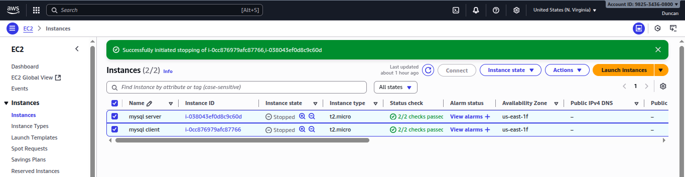  
