# 🛠️ Web Solution with WordPress — Tooling Project  

## 📘 Project Overview  
This project demonstrates the deployment of a **scalable web solution** using **multiple EC2 web servers**, a **centralized NFS server**, and **a remote MySQL database** on AWS.  
The setup ensures **consistent website content**, **centralized data management**, and **high availability**.

---

## 🧩 Architecture Overview  
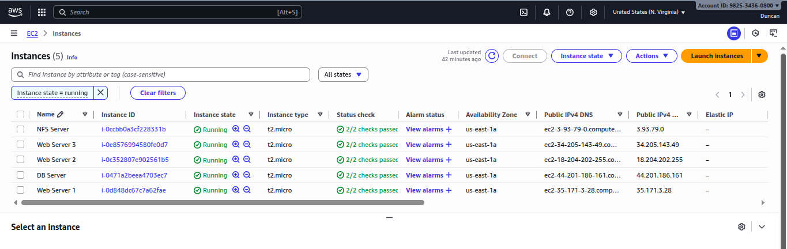

| Component | Description |
|------------|--------------|
| **NFS Server** | Central file storage shared with all web servers. |
| **Web Servers (Web1, Web2, Web3)** | Host Apache web server and pull shared website content from the NFS server. |
| **Database Server (MySQL)** | Stores website data and user credentials. |
| **EBS Volumes** | Extra storage attached to NFS and DB servers for persistence. |

---

## ☁️ AWS Setup

### 1️⃣ Create EC2 Instances  
Launched 5 EC2 instances — 1 Database, 1 NFS, and 3 Web Servers — all within the same VPC.  
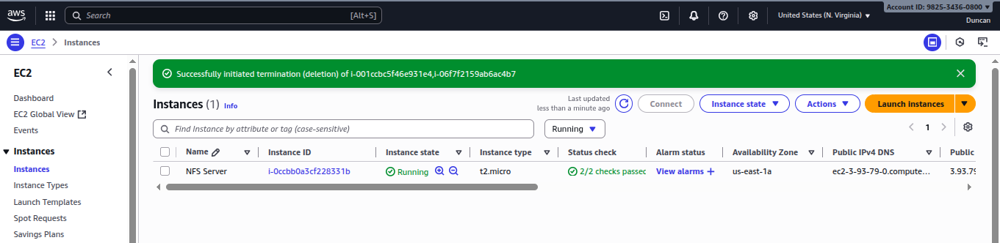  

### 2️⃣ Configure Security Groups  
Opened necessary inbound ports:
- **Web servers:** TCP 80 (HTTP)
- **NFS server:** TCP/UDP 2049
- **Database server:** TCP 3306 (MySQL)

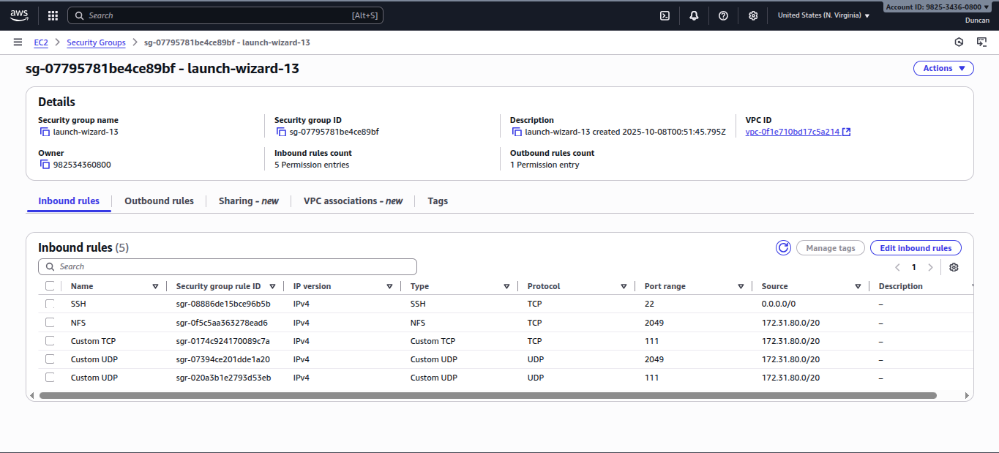
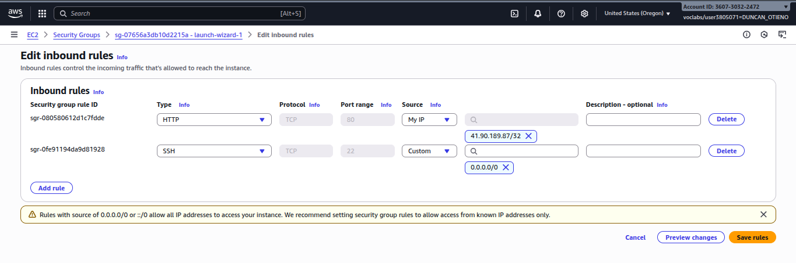
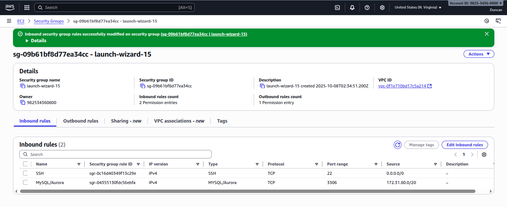
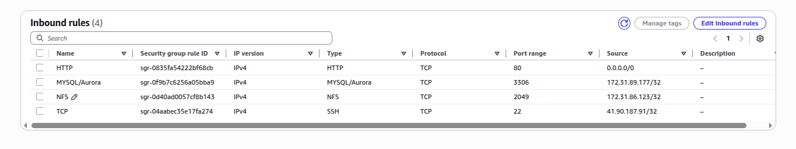
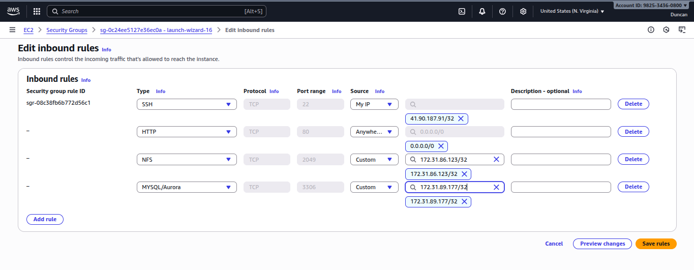

---

## 💾 NFS Server Configuration  

### 3️⃣ Attach and Configure EBS Volumes  
Attached 3 EBS volumes and verified block devices:  
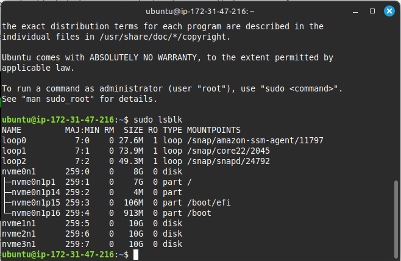  
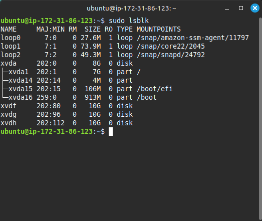

Created partitions and logical volumes:
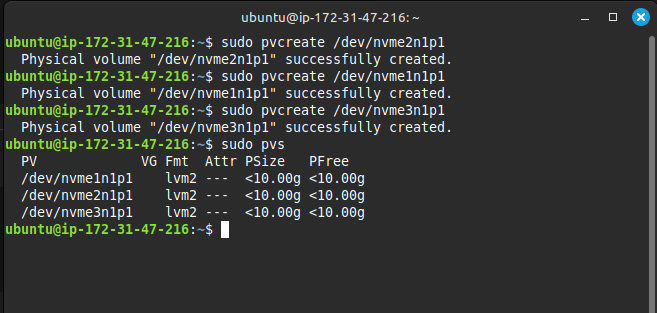
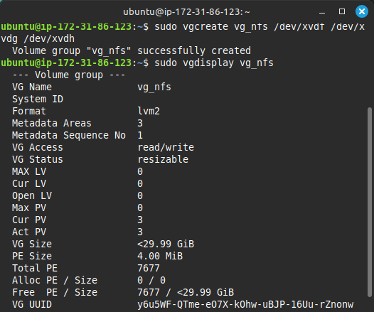
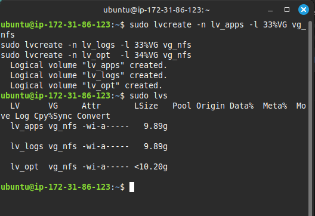

Formatted the volumes and mounted them:
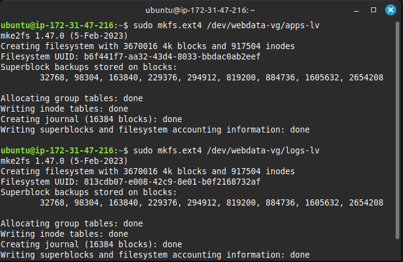
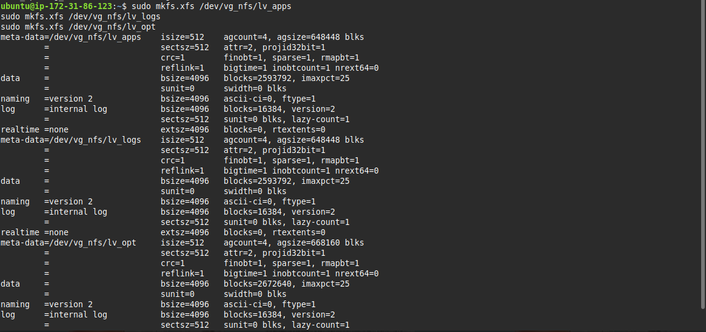
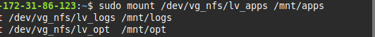
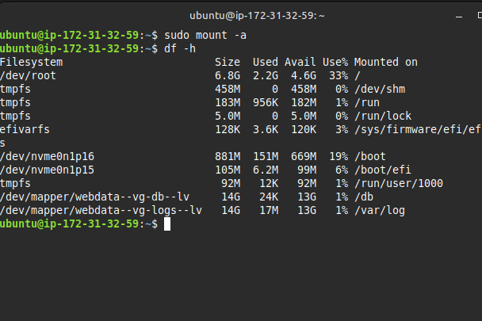

Configured mount points:
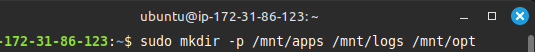
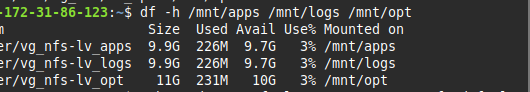

---

### 4️⃣ Install and Configure NFS  
Installed NFS utilities and shared directories:
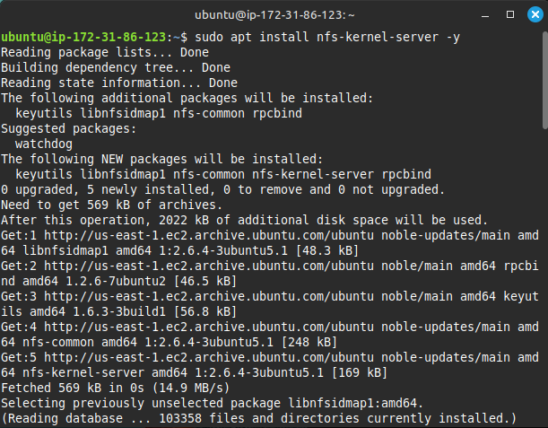
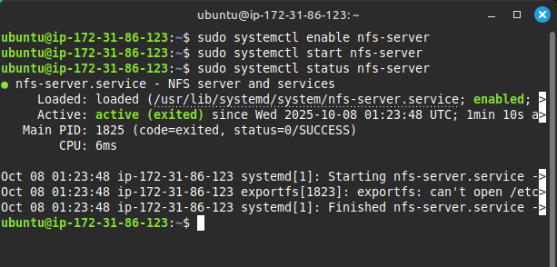
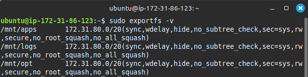
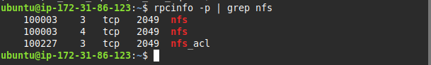

---

## 🌐 Web Servers Configuration  

### 5️⃣ Install Apache and Dependencies  
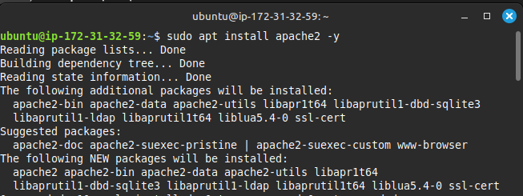
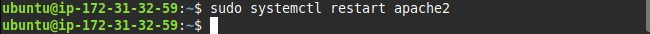

### 6️⃣ Mount NFS Shared Directory  
Mounted `/mnt/apps` from NFS server to each web server:  
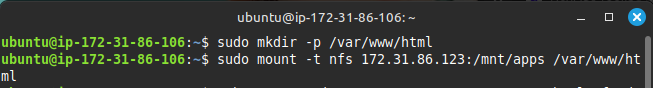
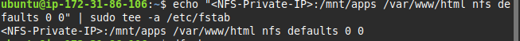
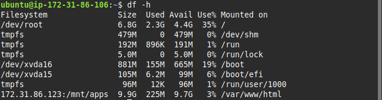

---

## 🗄️ Database Server Configuration  

### 7️⃣ Install MySQL and Secure It  
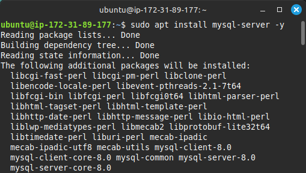
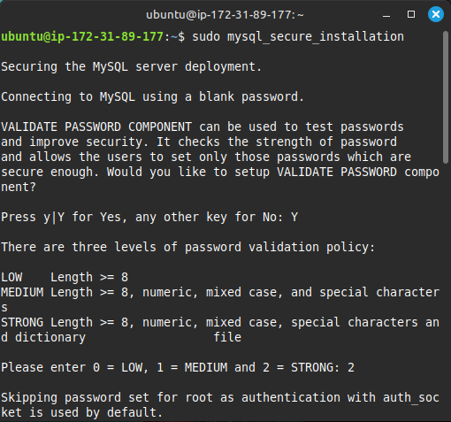
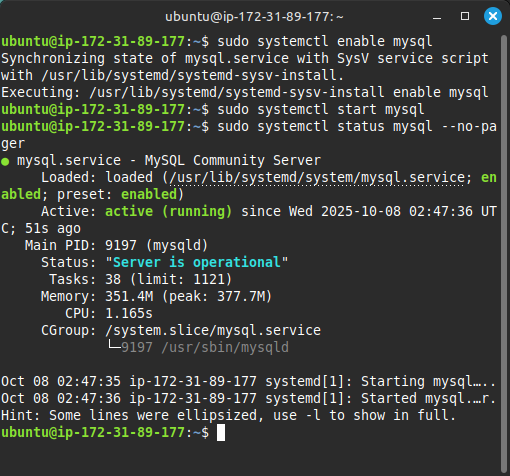

Created database and user:

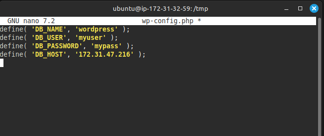

---

## 💻 Website Deployment  

### 8️⃣ Clone and Deploy Website Code  
Forked and cloned the tooling website from GitHub:  
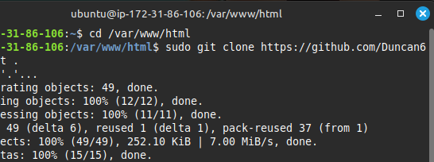

Deployed website files to `/var/www/html`:  
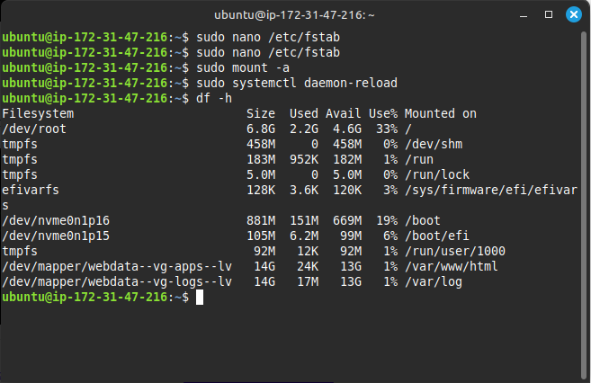

### 9️⃣ Configure PHP Connection  
Updated `functions.php` to connect to the remote MySQL database:  
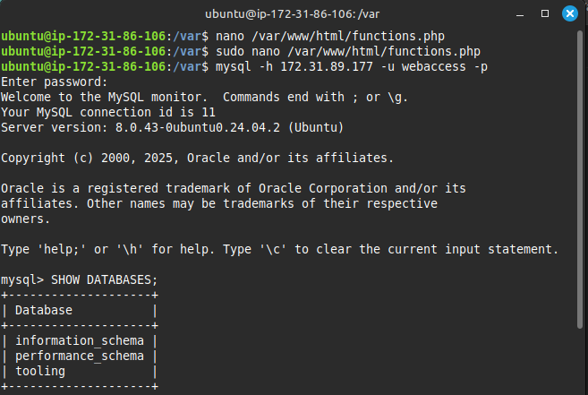

---

## 🔍 Verification  

Accessed the website on each web server’s public IP:  
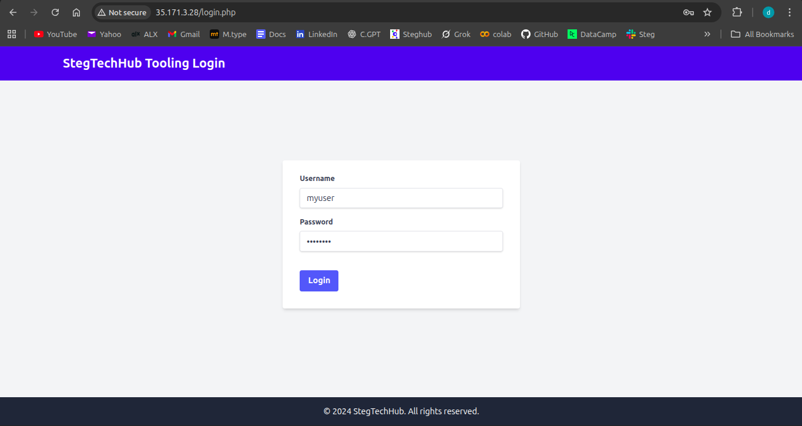
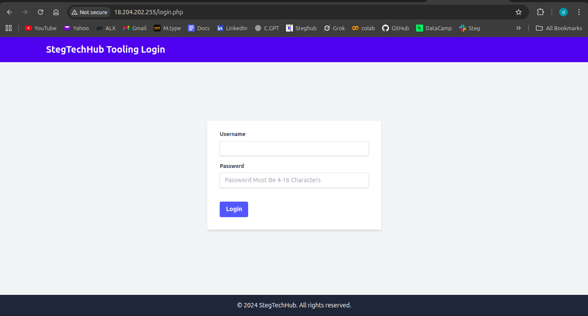
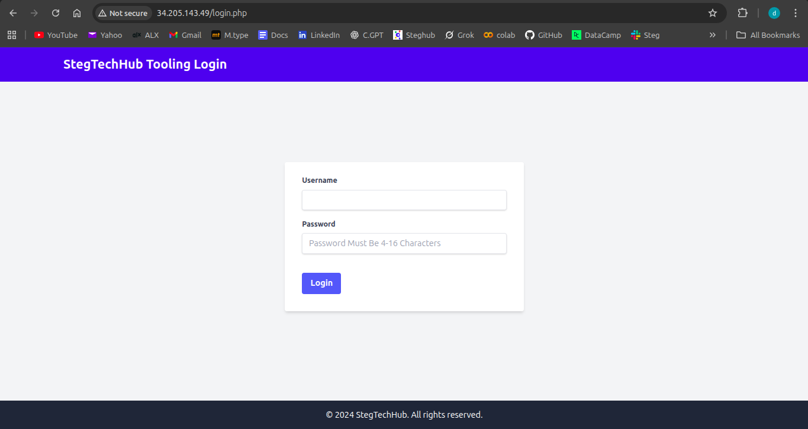

---

## 🧠 Cloud Concepts Simplified  

| Concept | Explanation | Analogy |
|----------|--------------|----------|
| **EBS Volume** | Extra storage attached to an EC2 instance for data persistence. | Like plugging in an external hard drive. |
| **Mounting** | Making an external drive accessible at a directory. | Like opening a folder from a USB drive on your laptop. |
| **NFS (Network File System)** | Lets multiple servers share and access the same files over a network. | Like having a shared Google Drive for your team. |
| **Apache Web Server** | Software that serves web pages to users’ browsers. | Like a waiter serving food (webpages) to customers (users). |

---

## 🚀 Outcome
✅ All three web servers displayed the same webpage.  
✅ Centralized NFS storage ensured consistency.  
✅ Remote database connection successfully configured.  

---

## 📈 Lessons Learned
- How to create and attach EBS volumes.  
- How to configure LVM for flexible storage management.  
- How to set up NFS for shared storage.  
- How to deploy and configure a website on multiple web servers.  
- How to connect web applications to a remote database.  

---
