# 🌀 Apache Load Balancer Solution on Ubuntu (DevOps Project)

This project demonstrates how to implement a **Load Balancer Solution using Apache on Ubuntu** as part of a **DevOps/Cloud Engineering workflow**.  
It showcases how multiple web servers can efficiently serve traffic through an Apache Load Balancer to improve availability, scalability, and fault tolerance.

---

## 🧱 Project Architecture

The setup consists of:
- **1 Load Balancer Server**
- **2 Web Servers (Web1 & Web2)**
- **1 NFS Server** (for shared storage)
- **1 Database Server** (for backend data management)

The Load Balancer routes incoming traffic between Web1 and Web2, while both web servers can access the shared NFS storage and communicate with the central database server.

### 🖥️ Architecture Diagram

```mermaid
graph TD
    User[🌍 Client/User] -->|HTTP Request| LB[⚙️ Apache Load Balancer]
    LB -->|Distributes Requests| Web1[🖥️ Web Server 1]
    LB -->|Distributes Requests| Web2[🖥️ Web Server 2]
    Web1 -->|Shared Storage| NFS[(📂 NFS Server)]
    Web2 -->|Shared Storage| NFS
    Web1 -->|DB Queries| DB[(🗄️ Database Server)]
    Web2 -->|DB Queries| DB

```


## ⚙️ Step 1: Launch EC2 Instances

Provision five Ubuntu EC2 instances on AWS:

Load Balancer

Web Server 1

Web Server 2

NFS Server

Database Server

✅ Make sure:

All instances are in the same VPC and availability zone (for simplicity)

Security groups are properly configured for inbound/outbound rules

Each server has a private IP for internal communication


## 🔒 Step 2: Configure Security Groups

Load Balancer Inbound Rules


Web Server 1 Inbound Rules


Web Server 2 Inbound Rules


NFS Inbound Rules


Database Server Inbound Rules


## 🧰 Step 3: Install Apache on Web Servers

Web Server 1

```
sudo apt update -y
sudo apt install apache2 -y
sudo systemctl start apache2
sudo systemctl enable apache2
sudo systemctl status apache2
```


Web Server 2

```
sudo apt update -y
sudo apt install apache2 -y
sudo systemctl start apache2
sudo systemctl enable apache2
sudo systemctl status apache2
```


## 🌐 Step 4: Set Up HTML Content on Each Web Server

On Web1:

```
echo "<h1>This is Web Server 1</h1>" | sudo tee /var/www/html/index.html
```


On Web2:

```
echo "<h1>This is Web Server 2</h1>" | sudo tee /var/www/html/index.html
```


Confirm via browser or curl:

## 🧩 Step 5: Configure Local DNS Resolution (on Load Balancer)

Edit the /etc/hosts file on your Load Balancer:

```
sudo nano /etc/hosts
Add your private IP mappings:
text172.31.xx.xx Web1
172.31.yy.yy Web2
```


Then test:

```
ping -c 2 Web1
```

```
ping -c 2 Web2
```

## ⚡ Step 6: Install and Configure Apache Load Balancer

Install Apache and required modules

```
sudo apt update -y
sudo apt install apache2 libxml2-dev -y
```


Enable proxy and load balancing modules

```
sudo a2enmod proxy
sudo a2enmod proxy_http
sudo a2enmod proxy_balancer
sudo a2enmod lbmethod_byrequests
sudo systemctl restart apache2
```


## 🧱 Step 7: Configure Virtual Host on Load Balancer

Edit:

```
sudo nano /etc/apache2/sites-available/000-default.conf
```

Add:

```
<VirtualHost *:80>
    ServerAdmin webmaster@localhost
    ServerName load-balancer
    DocumentRoot /var/www/html
    ProxyRequests Off
    ProxyPreserveHost On
    <Proxy "balancer://mycluster">
        BalancerMember http://Web1
        BalancerMember http://Web2
        ProxySet lbmethod=byrequests
    </Proxy>
    ProxyPass / balancer://mycluster/
    ProxyPassReverse / balancer://mycluster/
    <Location "/balancer-manager">
        SetHandler balancer-manager
        Require all granted
    </Location>
    ErrorLog ${APACHE_LOG_DIR}/error.log
    CustomLog ${APACHE_LOG_DIR}/access.log combined
</VirtualHost>
```

Test config and restart Apache:

```
sudo apache2ctl configtest
sudo systemctl restart apache2
```


## 🔄 Step 8: Test Load Balancing

Run from the Load Balancer:

```
curl http://Web1
curl http://Web2
```


Then test in browser using your public IP.

You should see alternating pages:


## 🧮 Step 9: Enable Balancer Manager for Monitoring

```
sudo a2enmod status
sudo systemctl restart apache2
```


Access the manager at:

```
texthttp://<Load-Balancer-Public-IP>/balancer-manager
```

## 📂 Step 10: NFS and Database Integration

NFS Server: Provides a shared directory for web servers to store logs or assets.

Database Server: Centralized data store accessible by both web servers for dynamic web apps.

✅ Final Verification

Load Balancer alternates traffic between Web1 and Web2 seamlessly, confirming high availability and performance.

🧹 Cleanup

After completing the project:

Terminate EC2 instances to avoid extra AWS charges

Delete Elastic IPs and key pairs (if not needed)

Remove security groups no longer in use

## 🧾 Summary

Load Balancer - Routes requests between multiple web servers

Web Servers - Serve HTML content to users

NFS Server - Provides shared file storage

Database Server - Centralized data management

Apache Modules Used,"proxy, proxy_http, proxy_balancer, lbmethod_byrequests"

## 🚀 Outcome

✅ High availability

✅ Seamless traffic distribution

✅ Improved fault tolerance

✅ Modular DevOps setup ready for scaling
