# 📚 Book Management App (Node.js + MongoDB on AWS EC2)

This project demonstrates how to set up a simple **Book Management Application** using **Node.js, Express, and MongoDB** hosted on an **AWS EC2 instance**.  
It supports adding, viewing, and deleting books via REST APIs.

---

## 🚀 Project Setup

### 1. Launch EC2 Instance
- Launch an **Ubuntu EC2 instance** in AWS.  
- Make sure to select a security group that allows inbound SSH and a custom **TCP port (3300)** for the app.  

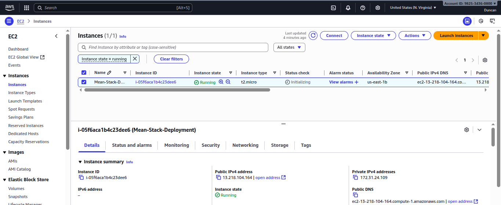

---

### 2. Install Dependencies

#### Update and install certificates

```
sudo apt update && sudo apt upgrade -y
sudo apt install -y ca-certificates curl gnupg
```

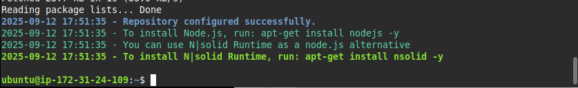

### 3. Installing NodeJS and npm

#### Installing NodeJS

```
sudo apt install nodejs -y
node -v
```

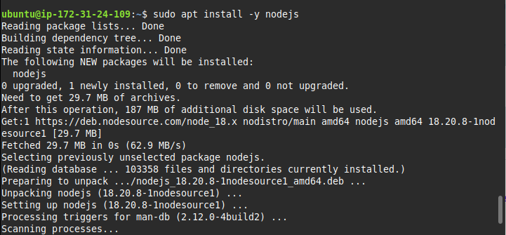  

### Installing npm

```
sudo apt install npm -y
npm -v
```

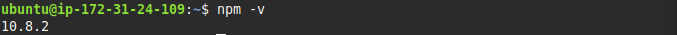  

### 4. Install MongoDB

#### Install GnuPG

```
sudo apt-get install -y gnupg curl
curl -fsSL https://www.mongodb.org/static/pgp/server-7.0.asc | \
   sudo gpg -o /usr/share/keyrings/mongodb-server-7.0.gpg \
   --dearmor
```
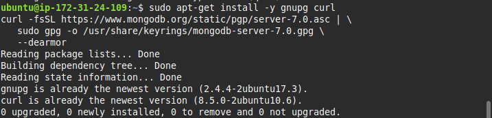  

### Install MongoDB
```
sudo apt-get install -y mongodb-org
```
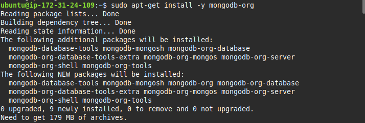 

### Starting, enabling, and checking the status of the server

```
sudo systemctl start mongodb
sudo systemctl enable mongodb
sudo systemctl status mongodb
```
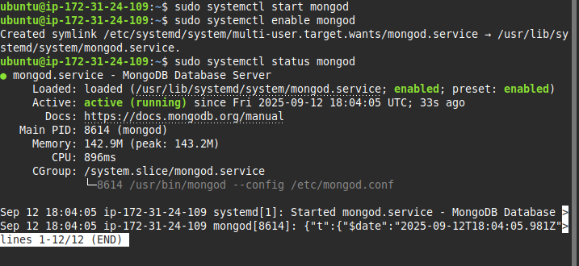  

### Installing and checking the status of Node Package Manager

```
sudo apt install npm -y
```
  

### Installing dependencies

```
sudo npm install body-parser
```
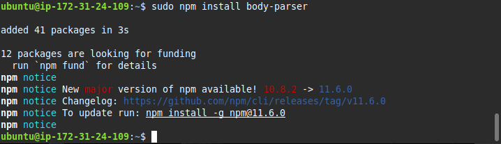  

### 5. Create Project Directory

```
mkdir Books
cd Books
```

#### Initialize npm

```
npm init -y
```
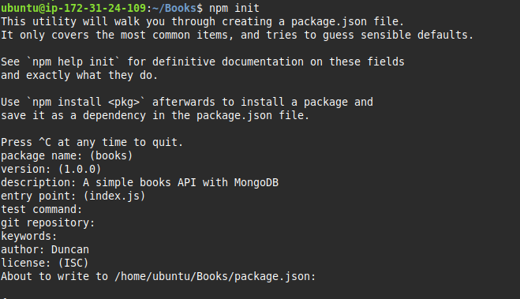  

### 6. Installing MOngoose

```
sudo npm install express mongoose
```
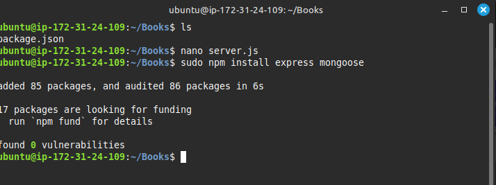  

#### Inside 'Books' folder, create a folder named apps

```
mkdir apps && cd apps
Create a file named routes.js
```


#### In the 'apps' folder, create a folder named models

```
mkdir models && cd models
Create a file named book.js
```

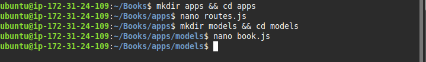 

### Access the Routes with AngularJS  

#### Navigate back to the **Books** directory:  

```
cd ../..
```

#### Create a public folder and move into it:

```
mkdir public && cd public
```

### Inside the public folder, create two files:

script.js → Contains the AngularJS controller configuration.

index.html → Contains the Book Management frontend (form + table).

Go back up to the Books directory and start the server:

```
cd ..
node server.js
```
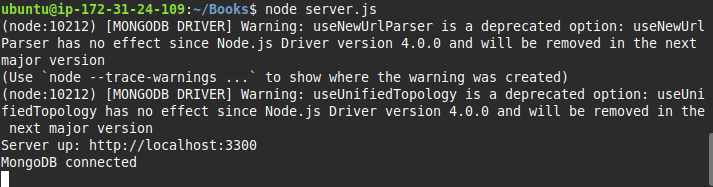  

Test locally:

```
curl -s http://localhost:3300
```

Open TCP port 3300 in your AWS EC2 Security Group to allow browser access.

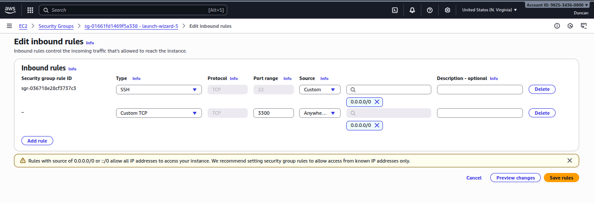  

Access your Book Register application in a browser using:

Public IP:
```
curl -s http://169.254.169.254/latest/meta-data/public-ipv4
```

Public DNS:
```
curl -s http://169.254.169.254/latest/meta-data/public-hostname
```
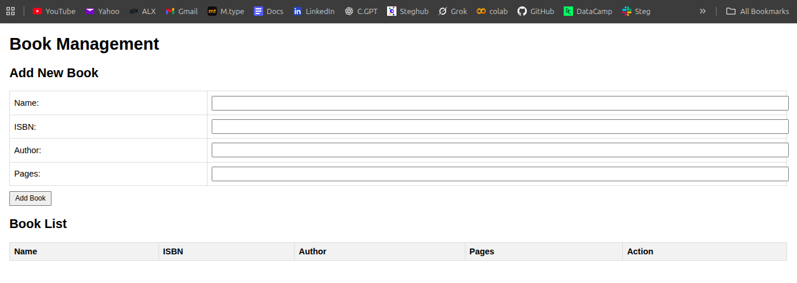  


