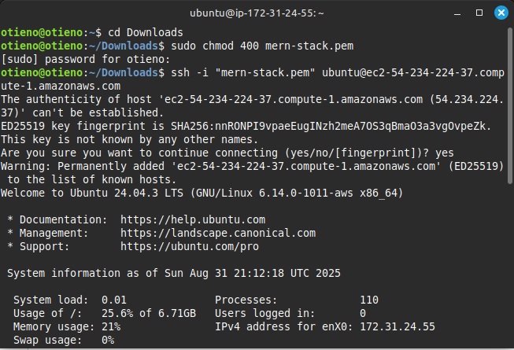
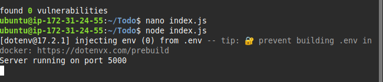
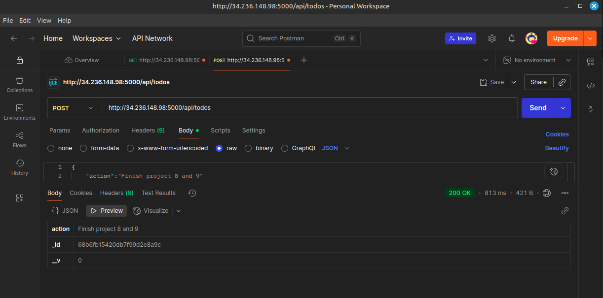

# MERN To-Do Application

# MERN Web Stack - 101
A simple **To-Do Application** built with the **MERN stack** (MongoDB, Express.js, React.js, Node.js) and deployed on **AWS EC2**.  
This project demonstrates **full-stack web development** combined with **cloud deployment** skills.  

---

## 📌 Features
- Add new tasks to a to-do list
- View all tasks
- Delete tasks
- Simple and responsive UI
- Backend API with MongoDB integration
- Cloud deployment on AWS EC2

---

## ⚙️ Tech Stack
- **MongoDB** – NoSQL document database for storing tasks
- **Express.js** – Backend framework for routing and APIs
- **React.js** – Frontend UI framework
- **Node.js** – JavaScript runtime environment
- **AWS EC2** – Hosting and deployment
- **Nginx** (optional for reverse proxy)
- **GitHub** – Version control

---

# MERN web Stack - 102

## Step 1 – Backend Configuration

In this step, we set up the **backend environment** for our MERN To-Do application on an Ubuntu server.
 

---

### 🔧 Update and Upgrade Ubuntu
First, update the package lists and upgrade the system:

 

```
sudo apt update
sudo apt upgrade
```

```
curl -fsSL https://deb.nodesource.com/setup_18.x | sudo -E bash -
sudo apt-get install -y nodejs
```

 

⚡ Note: The command above installs both Node.js and NPM.

NPM is a package manager for Node (similar to apt for Ubuntu).

It is used to install Node modules, packages, and manage dependency conflicts.

Verify installation:


```
node -v
npm -v
```

📂 Application Code Setup

Create a new project directory:

```
mkdir Todo
ls
```

✅ Use ls -lih to view more detailed information about files and directories.
Run ls --help to explore more useful options.

Navigate into the project directory:

```
cd Todo
```

📄 Initialize Node.js Project

Initialize a new Node.js project using npm init. This creates a package.json file that holds metadata about the project and its dependencies:

```
npm init
```

Press Enter to accept the default values.

When prompted, type yes to confirm and create the file.

Verify that the package.json file was created:

```
ls
```

# MERN Web Stack - 103

## Step 1: Install ExpressJS

Express is a framework for Node.js that simplifies backend development. It provides tools to define routes, handle requests, and manage responses.

### Install Express

  

```
npm install express
```

Create the index.js file
```
touch index.js
ls
```

The ls command should confirm that index.js was created.

Install dotenv

dotenv is used to manage environment variables.

```
npm install dotenv
```
  

Edit the index.js file

```
nano index.js
```

Paste the following code inside:

```
const express = require('express');
require('dotenv').config();

const app = express();
const port = process.env.PORT || 5000;

app.use((req, res, next) => {
  res.header("Access-Control-Allow-Origin", "*");
  res.header("Access-Control-Allow-Headers", "Origin, X-Requested-With, Content-Type, Accept");
  next();
});

app.use((req, res, next) => {
  res.send('Welcome to Express');
});

app.listen(port, () => {
  console.log(`Server running on port ${port}`);
});
```

Save the file in nano:

Press CTRL + O → Enter (to write/save)

Press CTRL + X (to exit)

Step 2: Start the Server

In the same directory as index.js, run:

```
node index.js
```

If successful, you should see:

Server running on port 5000

  

Step 3: Allow Port 5000 in Security Group

Update your EC2 Security Group to allow inbound traffic:

  

```
Type: Custom TCP Rule

Port Range: 5000

Source: 0.0.0.0/0 (Anywhere)

Step 4: Test in Browser

Open your browser and go to:

http://<PublicIP-or-PublicDNS>:5000
```

You should see:

Welcome to Express

To retrieve your server’s details:

Public IP:

```
curl -s http://169.254.169.254/latest/meta-data/public-ipv4
```

Public DNS:

```
curl -s http://169.254.169.254/latest/meta-data/public-hostname
```

Step 5: Create Routes

Our To-Do application must handle three actions:

Create a new task (POST)

Display all tasks (GET)

Delete a task (DELETE)

We’ll define these routes next.

Create routes directory

```
mkdir routes
cd routes
```

Create api.js

```
touch api.js
```

```
nano api.js
```

Paste the following starter code:

```
const express = require('express');
const router = express.Router();

router.get('/todos', (req, res, next) => {
  // Get all todos
});

router.post('/todos', (req, res, next) => {
  // Create a new todo
});

router.delete('/todos/:id', (req, res, next) => {
  // Delete a todo by ID
});

module.exports = router;
```

Save and exit with CTRL+O, Enter, CTRL+X.

# MERN Web Stack - 104

## Step 1: Install and Configure Mongoose

Since our application will use **MongoDB** (a NoSQL database), we need to define models and schemas.  
- A **Schema** is a blueprint of how the database will be structured.  
- A **Model** uses this schema to interact with the database.  

We will use **Mongoose**, a Node.js package that simplifies working with MongoDB.

### Install Mongoose
From the root of your `Todo` project:

```
npm install mongoose
```

  

Step 2: Create the Models Directory

```
mkdir models
cd models
touch todo.js
```

(Alternatively, you can run this in one line:)

```
mkdir models && cd models && touch todo.js
```

Step 3: Define the Todo Model

Open the todo.js file:

```
nano todo.js
```

Paste the following code:

```
const mongoose = require('mongoose');
const Schema = mongoose.Schema;

// Create schema for todo
const TodoSchema = new Schema({
  action: {
    type: String,
    required: [true, 'The todo text field is required']
  }
});

// Create model for todo
const Todo = mongoose.model('todo', TodoSchema);

module.exports = Todo;
```

Save and exit with:

CTRL + O → Enter (save)

CTRL + X (exit)

Step 4: Update Routes to Use the Model

Navigate back to the routes directory:

```
cd ../routes
```

Open the api.js file:

```
nano api.js
```

Replace its contents with:

```
const express = require('express');
const router = express.Router();
const Todo = require('../models/todo');

// Get all todos
router.get('/todos', (req, res, next) => {
  // Return only the id and action field
  Todo.find({}, 'action')
    .then(data => res.json(data))
    .catch(next);
});

// Create a new todo
router.post('/todos', (req, res, next) => {
  if (req.body.action) {
    Todo.create(req.body)
      .then(data => res.json(data))
      .catch(next);
  } else {
    res.json({ error: "The input field is empty" });
  }
});

// Delete a todo by ID
router.delete('/todos/:id', (req, res, next) => {
  Todo.findOneAndDelete({ "_id": req.params.id })
    .then(data => res.json(data))
    .catch(next);
});

module.exports = router;
```

Save and exit with CTRL+O, Enter, CTRL+X.

# MERN Web Stack - 105

## Step 1: Set Up MongoDB with mLab (MongoDB Atlas)
We need a database to store our data. For this, we will use **MongoDB Atlas** (previously mLab), which provides MongoDB Database-as-a-Service (DBaaS).

1. Go to https://www.mongodb.com/atlas and **sign up** for a free account.  
2. During setup:
   - Select **AWS** as the cloud provider.
   - Choose a region close to you.  
3. Complete the **Get Started Checklist**:
   - Allow access to your MongoDB database from **anywhere (0.0.0.0/0)**.  
     *(⚠️ Not secure for production, but fine for testing)*  
   - Change temporary whitelist access from **6 Hours → 1 Week**.  
4. Create a **Database** and a **Collection** inside your cluster.  

---

## Step 2: Create the `.env` File
Inside the root of your `Todo` project, create a `.env` file:  

```
touch .env
nano .env
```

Paste the following line into the file:

```
DB = 'mongodb+srv://<username>:<password>@<network-address>/<dbname>?retryWrites=true&w=majority'
```

👉 Replace <username>, <password>, <network-address>, and <dbname> with the actual values from your MongoDB Atlas setup.

Save and exit:

CTRL + O → Enter (save), CTRL + X (exit)

Step 3: Update index.js

We now need to update our index.js file so that it uses the environment variables and connects to MongoDB.

Open the file:

```
nano index.js
```

Delete any existing code inside and paste this:

```
const express = require('express');
const bodyParser = require('body-parser');
const mongoose = require('mongoose');
const routes = require('./routes/api');
const path = require('path');
require('dotenv').config();

const app = express();
const port = process.env.PORT || 5000;

// Connect to the database
mongoose.connect(process.env.DB, {
  useNewUrlParser: true,
  useUnifiedTopology: true
})
.then(() => console.log('Database connected successfully'))
.catch(err => console.log(err));

// Override Mongoose's deprecated promise with Node's promise
mongoose.Promise = global.Promise;

// Middleware
app.use((req, res, next) => {
  res.header("Access-Control-Allow-Origin", "*");
  res.header("Access-Control-Allow-Headers", "Origin, X-Requested-With, Content-Type, Accept");
  next();
});

app.use(bodyParser.json());
app.use('/api', routes);

// Error handling middleware
app.use((err, req, res, next) => {
  console.log(err);
  next();
});

// Start server
app.listen(port, () => {
  console.log(`Server running on port ${port}`);
});
```

Save and exit (CTRL+O, Enter, CTRL+X).

Step 4: Start the Server

Run the server:

```
node index.js
```

If everything is set up correctly, you should see:

Database connected successfully
Server running on port 5000

  

✅ At this point:

Your backend is connected to MongoDB Atlas.

You can now test API routes (GET, POST, DELETE) using Postman.

# MERN Web Stack - 106

## Step 1: Testing Backend Code without Frontend (Using Postman)

So far, we have built the **backend** of our To-Do application and connected it to a **MongoDB database**, but we don’t yet have a frontend UI.  
To test the backend APIs during development, we will use **Postman**, a popular API testing tool.

---

### Step 2: Install Postman
Download and install **Postman** on your local machine:  

```
https://www.postman.com/downloads/
```

---

### Step 3: Test API Endpoints

We created three endpoints in our backend (`/api/todos`) using Express and MongoDB:

1. **Create a New Task** → `POST /api/todos`  
2. **Get All Tasks** → `GET /api/todos`  
3. **Delete a Task by ID** → `DELETE /api/todos/:id`

We will now test these APIs with Postman.

---

#### **1. Create a New Task (POST Request)**
- Open **Postman**
- Select **POST** request  
- Enter the URL:  

http://<PublicIP-or-PublicDNS>:5000/api/todos

- Go to **Headers** tab and set:


Key: Content-Type
Value: application/json

- Go to **Body** tab → Select **raw** → Choose **JSON** format  
- Enter JSON payload:
- 
```
{
  "action": "Finish project 8 and 9"
}
```

Click Send

✅ You should get a response like:

{
  "_id": "64f1a234abcd56789ef12345",
  "action": "Finish project 8 and 9",
  "__v": 0
}

  

This confirms that the task was successfully created and stored in MongoDB.

2. Get All Tasks (GET Request)

Create a GET request in Postman

Enter the URL:

```
http://<PublicIP-or-PublicDNS>:5000/api/todos
```

Click Send

✅ You should see an array of all tasks:

```
[
  {
    "_id": "64f1a234abcd56789ef12345",
    "action": "Finish project 8 and 9"
  },
  {
    "_id": "64f1b456cdef67890ab12345",
    "action": "Write project documentation"
  }
]
```
  

3. Delete a Task (DELETE Request)

Copy the _id of a task from the GET response

Create a DELETE request in Postman

Enter the URL (replace <task_id> with the copied ID):

```
http://<PublicIP-or-PublicDNS>:5000/api/todos/<task_id>
```

Click Send

✅ You should see the deleted task as the response:

```
{
  "_id": "64f1a234abcd56789ef12345",
  "action": "Finish MERN project",
  "__v": 0
}
```

Step 4: Verify Server Logs

Check your terminal where Node.js is running — you should see logs confirming the API calls and database actions.


# MERN Web Stack - 107

## Step 2: Frontend Creation

Now that our backend API is fully functional, we will build a **frontend (ReactJS)** so that users can interact with our To-Do application via a web browser.

---

### Step 1: Create React App

In the same root directory as your backend (`Todo`), run:

```
npx create-react-app client
```

  


This will create a new folder called client inside your Todo directory.

All React code will live inside this client folder.

Step 2: Install Development Tools

We need a few tools to make development easier:

Concurrently – allows running multiple commands (server + client) in one terminal.

```
npm install concurrently --save-dev
```

  

Nodemon – automatically restarts the server when file changes are detected.

```
npm install nodemon --save-dev
```

  

Step 3: Update package.json Scripts

Open package.json in your Todo root directory and update the scripts section:

```
"scripts": {
  "start": "node index.js",
  "start-watch": "nodemon index.js",
  "dev": "concurrently \"npm run start-watch\" \"cd client && npm start\""
}
```

start → runs the backend with Node.

start-watch → runs the backend with Nodemon (auto-restart).

dev → runs both backend and frontend simultaneously.

Step 4: Configure Proxy in React

We want React to forward API calls to our backend (http://localhost:5000) without needing to type the full path every time.

Change directory to client:

```
cd client
```

Open package.json and add this line at the root level (just after "name" or "version"):

```
"proxy": "http://localhost:5000"
```

Step 5: Run the Application

Go back to the root Todo directory and run:

```
npm run dev
```

This will start both:

The backend server on port 5000

The React frontend on port 3000

Open your browser and visit:

```
http://localhost:3000
```

You should see the default React app running.

Step 6: Enable Access from the Internet

If you are running this project on an AWS EC2 instance, you must open TCP port 3000 in the Security Group settings.

Go to your EC2 instance → Security → Inbound Rules → Add Rule:

```
Type: Custom TCP Rule
Port Range: 3000
Source: 0.0.0.0/0   (for testing only; restrict later for security)
```

  

# MERN Web Stack - 108

## Step 3: Creating React Components

One of the biggest advantages of **React** is that it is **component-based**. Components make code reusable, modular, and easier to maintain.  

For our To-Do app, we will create **three components**:
- **Input.js** → For adding new tasks  
- **ListTodo.js** → For displaying tasks  
- **Todo.js** → Main container that manages state  

  

  

---

### Step 1: Setup Components Folder

Navigate to the `src` folder inside your React app and create a `components` directory:

```
cd client/src
mkdir components
cd components
```
  

Create the three component files:

```
touch Input.js ListTodo.js Todo.js
```


Step 2: Input Component

Open Input.js and add the following code:

```
import React, { Component } from 'react';
import axios from 'axios';

class Input extends Component {
  state = { action: "" }

  addTodo = () => {
    const task = { action: this.state.action }
    if (task.action && task.action.length > 0) {
      axios.post('/api/todos', task)
        .then(res => {
          if (res.data) {
            this.props.getTodos();
            this.setState({ action: "" })
          }
        })
        .catch(err => console.log(err))
    } else {
      console.log('input field required')
    }
  }

  handleChange = (e) => {
    this.setState({ action: e.target.value })
  }

  render() {
    let { action } = this.state;
    return (
      <div>
        <input type="text" onChange={this.handleChange} value={action} />
        <button onClick={this.addTodo}>add todo</button>
      </div>
    )
  }
}

export default Input;
```

Step 3: Install Axios

Axios is a promise-based HTTP client we will use for API calls.

From the client folder, install Axios:

```
cd ../..
npm install axios
cd src/components
```

  

Step 4: ListTodo Component

Open ListTodo.js and add:

```
import React from 'react';

const ListTodo = ({ todos, deleteTodo }) => {
  return (
    <ul>
      {todos && todos.length > 0 ? (
        todos.map(todo => {
          return (
            <li key={todo._id} onClick={() => deleteTodo(todo._id)}>
              {todo.action}
            </li>
          )
        })
      ) : (
        <li>No todo(s) left</li>
      )}
    </ul>
  )
}

export default ListTodo;

Step 5: Todo Component

Open Todo.js and add:

import React, { Component } from 'react';
import axios from 'axios';
import Input from './Input';
import ListTodo from './ListTodo';

class Todo extends Component {
  state = { todos: [] }

  componentDidMount() {
    this.getTodos();
  }

  getTodos = () => {
    axios.get('/api/todos')
      .then(res => {
        if (res.data) {
          this.setState({ todos: res.data })
        }
      })
      .catch(err => console.log(err))
  }

  deleteTodo = (id) => {
    axios.delete(`/api/todos/${id}`)
      .then(res => {
        if (res.data) {
          this.getTodos()
        }
      })
      .catch(err => console.log(err))
  }

  render() {
    let { todos } = this.state;
    return (
      <div>
        <h1>My Todo(s)</h1>
        <Input getTodos={this.getTodos} />
        <ListTodo todos={todos} deleteTodo={this.deleteTodo} />
      </div>
    )
  }
}

export default Todo;
```

Step 6: Update App.js

Navigate back to src and update App.js:

```
import React from 'react';
import Todo from './components/Todo';
import './App.css';

const App = () => {
  return (
    <div className="App">
      <Todo />
    </div>
  );
}

export default App;
```

Step 7: Style the App
Update App.css:

```
.App {
  text-align: center;
  font-size: calc(10px + 2vmin);
  width: 60%;
  margin-left: auto;
  margin-right: auto;
}

input {
  height: 40px;
  width: 50%;
  border: none;
  border-bottom: 2px #101113 solid;
  background: none;
  font-size: 1.5rem;
  color: #787a80;
}

input:focus {
  outline: none;
}

button {
  width: 25%;
  height: 45px;
  border: none;
  margin-left: 10px;
  font-size: 25px;
  background: #101113;
  border-radius: 5px;
  color: #787a80;
  cursor: pointer;
}

button:focus {
  outline: none;
}

ul {
  list-style: none;
  text-align: left;
  padding: 15px;
  background: #171a1f;
  border-radius: 5px;
}

li {
  padding: 15px;
  font-size: 1.5rem;
  margin-bottom: 15px;
  background: #282c34;
  border-radius: 5px;
  overflow-wrap: break-word;
  cursor: pointer;
}

@media only screen and (min-width: 300px) {
  .App {
    width: 80%;
  }
  input {
    width: 100%
  }
  button {
    width: 100%;
    margin-top: 15px;
    margin-left: 0;
  }
}

@media only screen and (min-width: 640px) {
  .App {
    width: 60%;
  }
  input {
    width: 50%;
  }
  button {
    width: 30%;
    margin-left: 10px;
    margin-top: 0;
  }
}

Update index.css:
body {
  margin: 0;
  padding: 0;
  font-family: -apple-system, BlinkMacSystemFont, "Segoe UI", "Roboto", "Oxygen", "Ubuntu", "Cantarell", "Fira Sans", "Droid Sans", "Helvetica Neue", sans-serif;
  -webkit-font-smoothing: antialiased;
  -moz-osx-font-smoothing: grayscale;
  box-sizing: border-box;
  background-color: #282c34;
  color: #787a80;
}

code {
  font-family: source-code-pro, Menlo, Monaco, Consolas, "Courier New", monospace;
}
```

Step 8: Run the Application

Go back to the Todo root directory and run:

```
cd ../..
```

```
npm run dev
```

  


This will:

Start the backend server on port 5000

Start the React frontend on port 3000

✅ Final Result

Your To-Do App is now fully functional with the following features:

Add a task

Delete a task

View all tasks

Congratulations 🎉 You have successfully built and deployed a MERN stack application!
