# Tooling Website Deployment Automation with Jenkins (CI)

## 📌 Project Overview

This project demonstrates how to automate the deployment of a tooling website using **Jenkins Continuous Integration (CI)**. The pipeline pulls source code from GitHub, archives build artifacts, and securely copies them to a shared **NFS server**, which is mounted by multiple web servers. Any change pushed to GitHub automatically triggers Jenkins, ensuring up-to-date deployments.

This project is part of a **DevOps/Cloud Engineering learning series** and focuses on hands-on CI fundamentals.

---

## 🏗️ Architecture

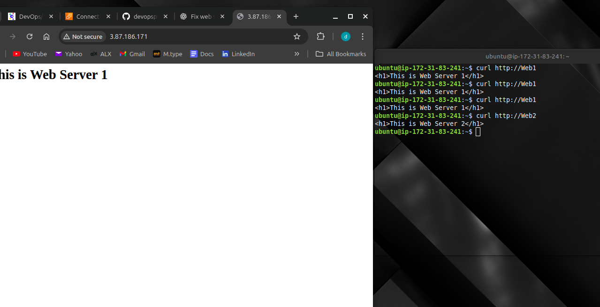
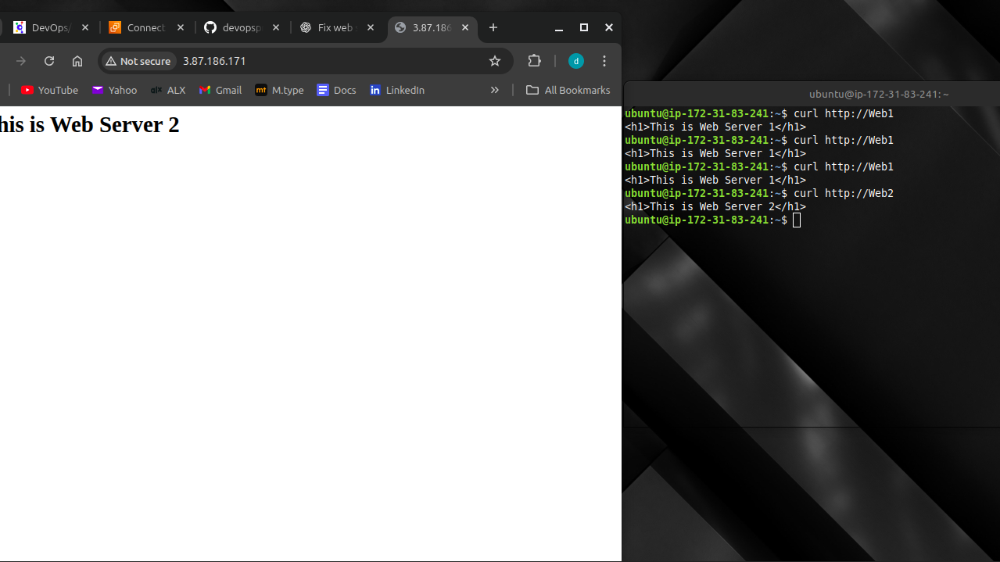

**Components Used:**

* **GitHub** – Source code repository
* **Jenkins** – Continuous Integration server
* **NFS Server (Ubuntu EC2)** – Central artifact storage (`/mnt/apps`)
* **Web Servers (RHEL/Ubuntu EC2)** – Consume files from NFS
* **SSH** – Secure communication between Jenkins and NFS

**High-level flow:**

1. Developer pushes code to GitHub
2. GitHub webhook triggers Jenkins job
3. Jenkins clones repository and archives artifacts
4. Jenkins copies artifacts to NFS server via SSH
5. Web servers access updated files from NFS

---

## 🧰 Tools & Technologies

* Jenkins
* Git & GitHub
* Ubuntu Linux
* AWS EC2
* NFS
* SSH
* Publish Over SSH Jenkins Plugin

---

## ⚙️ Prerequisites

Before starting, ensure you have:

* AWS EC2 instances running:

  * 1 Jenkins server (Ubuntu)
  * 1 NFS server (Ubuntu)
  * 2 Web servers
* Jenkins installed and running
* Git installed on Jenkins server
* Port **8080** open on Jenkins server
* Port **22** open on all servers
* NFS configured and mounted at `/mnt/apps`

---

## 🚀 Step-by-Step Implementation

### Step 1: Install and Set Up Jenkins

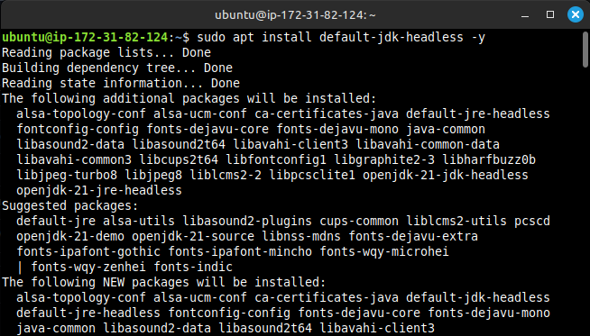


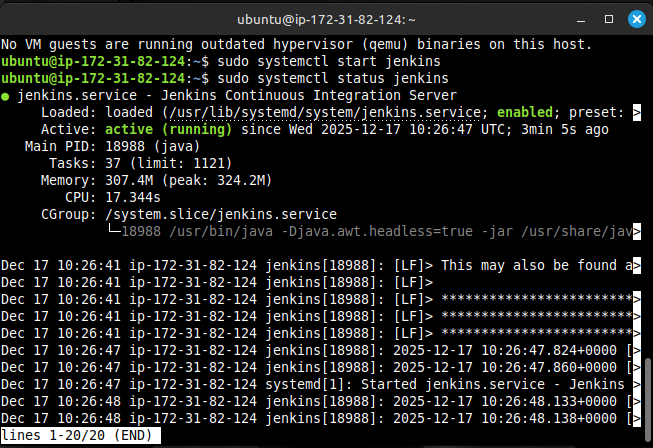

1. Install Java
2. Install Jenkins
3. Start and enable Jenkins service
4. Access Jenkins via browser on port 8080
5. Unlock Jenkins using the admin password
6. Complete initial setup

---

### Step 2: Create Jenkins Job


1. Click **New Item**
2. Enter project name: `tooling-github`
3. Select **Freestyle project**
4. Configure **Source Code Management**:

   * Git
   * Repository URL: GitHub repo URL
   * Branch: `main`
5. Save and build the job

✔ Jenkins successfully clones the repository

---

### Step 3: Configure Artifact Archiving

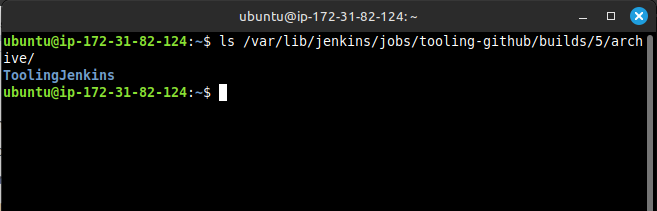
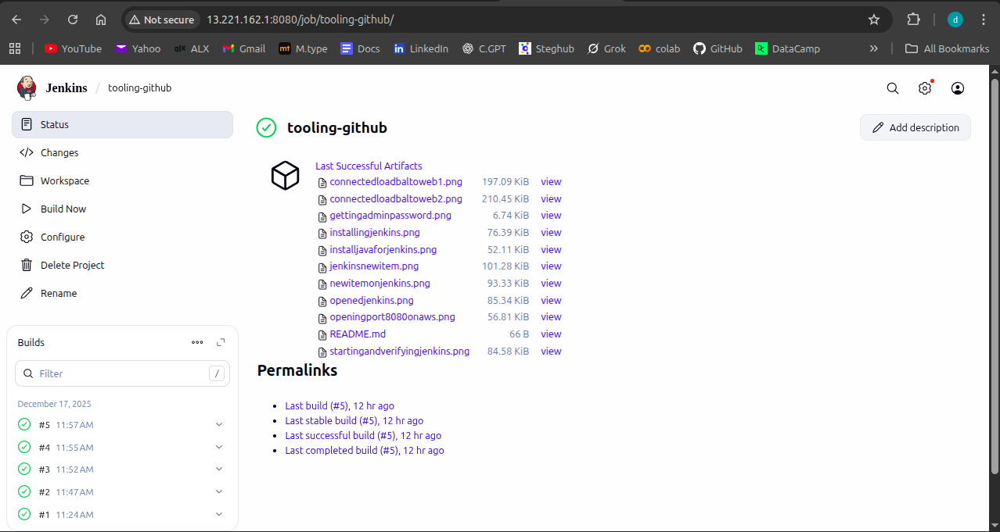

1. Open job configuration
2. Under **Post-build Actions**, select:

   * **Archive the artifacts**
3. Specify artifacts:

   ```
   ToolingJenkins/**
   ```
4. Save and build

✔ Artifacts are now stored by Jenkins

---

### Step 4: Install Publish Over SSH Plugin

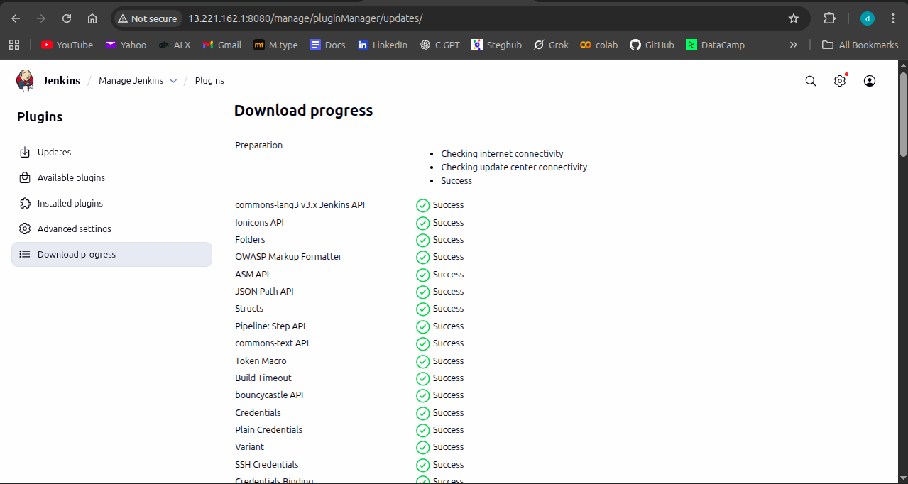

1. Go to **Manage Jenkins → Manage Plugins**
2. Search for **Publish Over SSH**
3. Install plugin and restart Jenkins

---

### Step 5: Configure Publish Over SSH

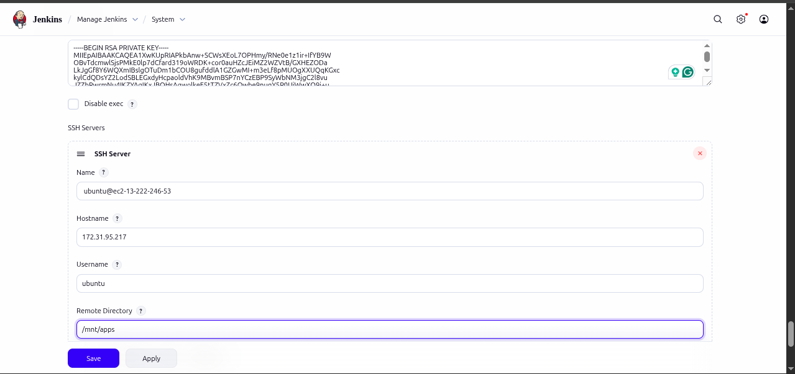
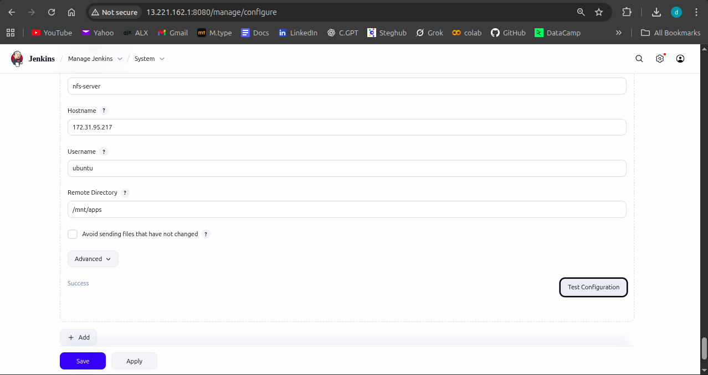

1. Go to **Manage Jenkins → Configure System**
2. Scroll to **Publish over SSH**
3. Configure SSH server:

| Field            | Value                      |
| ---------------- | -------------------------- |
| Name             | NFS-Server                 |
| Hostname         | NFS Private IP             |
| Username         | ubuntu                     |
| Remote Directory | /mnt/apps                  |
| SSH Key          | Private key (.pem) content |

4. Test connection → **SUCCESS**
5. Save configuration

---

### Step 6: Copy Artifacts to NFS Server

1. Open Jenkins job → Configure
2. Add **Post-build Action → Send build artifacts over SSH**
3. Select configured SSH server
4. Add Transfer:

| Field            | Value         |
| ---------------- | ------------- |
| Source files     | **            |
| Remote directory | (leave empty) |
| Exec command     | (leave empty) |

5. Save configuration

---

### Step 7: Trigger CI Pipeline

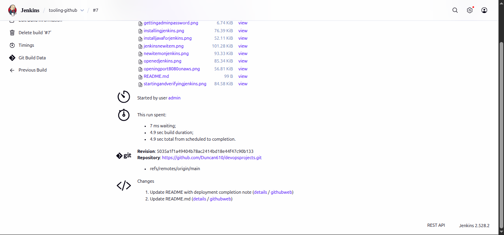
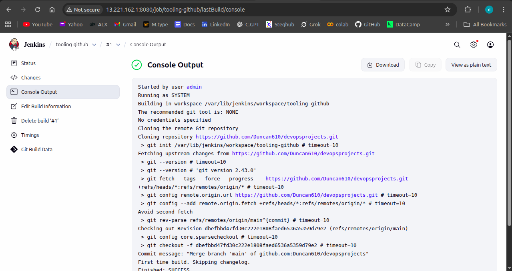
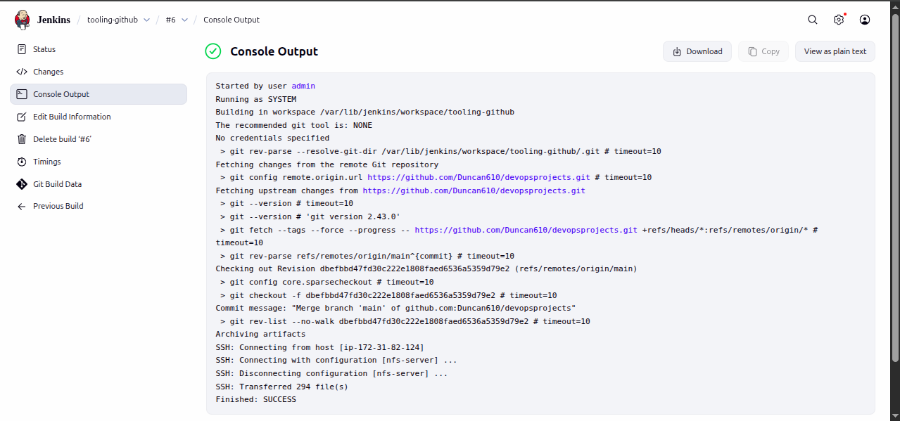

* Make a change to `README.md` in GitHub
* Push changes to `main` branch
* GitHub webhook triggers Jenkins build

✔ Console output shows:

```
SSH: Transferred xx file(s)
Finished: SUCCESS
```

---

### Step 8: Verify changes on NFS Server

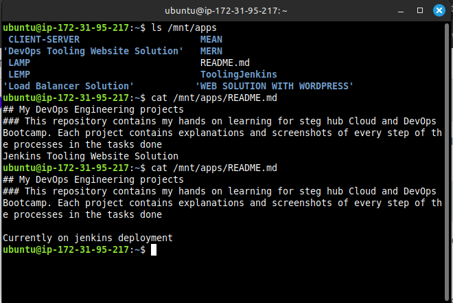

SSH into NFS server:

```bash
ls /mnt/apps
cat /mnt/apps/README.md
```

✔ Files are updated successfully

---

## 📸 Screenshots

Screenshots documenting each step are available in the `ToolingJenkins/` directory:

* Jenkins installation
* Job creation
* Plugin installation
* Artifact archiving
* Successful SSH transfer

---

## ✅ Key Learnings

* Implemented Jenkins-based CI pipeline
* Automated artifact archiving and deployment
* Configured secure SSH-based file transfer
* Used NFS for centralized storage
* Integrated GitHub webhooks with Jenkins

---

## 📈 Project Outcome

This project delivers a working Continuous Integration solution that ensures every code change is automatically built, archived, and deployed to a shared NFS location, enabling consistent updates across multiple servers.

---

## 🔗 Repository Structure

```
ToolingJenkins/
├── README.md
├── installingjenkins.png
├── installjavaforjenkins.png
├── jenkinsnewitem.png
├── newitemonjenkins.png
├── openingport8080onaws.png
├── startingandverifyingjenkins.png
└── ...
```

---

## 🏁 Conclusion

This project demonstrates a complete Jenkins CI workflow from source control to automated deployment. It lays a strong foundation for more advanced CI/CD pipelines involving testing, Docker, and Kubernetes in future projects.
