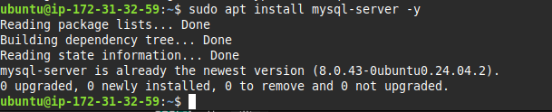

# Web Solution With WordPress  

This project demonstrates how to implement a **web solution using WordPress** with a **two-server architecture** on AWS.  

As a DevOps engineer, one of the most common solutions you will encounter is **PHP-based applications** such as WordPress, which is still one of the most widely used web content management systems in the world. WordPress is written in **PHP** and uses **MySQL** (or MariaDB) as its relational database management system (RDBMS).  

In this project, I deployed a **three-tier architecture** that mirrors how real-world web solutions are built:  

- **Presentation Layer (PL):** The client interface (browser or curl from a laptop/PC).  
- **Business Layer (BL):** The Web Server running Apache and WordPress.  
- **Data Layer (DAL):** The Database Server running MySQL.  

---

## 📌 Project Objectives  

The project was divided into **two main parts**:  

1. **Storage Subsystem Configuration**  
   - Configure and manage storage infrastructure for both the Web and Database servers using **EBS volumes** and **LVM (Logical Volume Manager)**.  
   - Work with partitions, physical volumes, volume groups, and logical volumes.  
   - Set up dedicated partitions for application files (`/var/www/html`) and log storage (`/var/log`).  

2. **WordPress Deployment**  
   - Install and configure **Apache, PHP, and WordPress** on the Web Server (Ubuntu).  
   - Install and configure **MySQL Server** on the Database Server.  
   - Connect WordPress (on the Web Server) to the MySQL Database (on the DB Server).  

---

## 🏗️ Technology Stack  

- **Cloud Provider:** AWS EC2  
- **Operating System:** Ubuntu Linux (instead of RedHat/CentOS)  
- **Storage Management:** EBS Volumes, gdisk, LVM  
- **Web Tier:** Apache, PHP, WordPress  
- **Database Tier:** MySQL Server  
- **Security:** AWS Security Groups, Firewall (UFW), MySQL user privileges  

## 📸 Step-by-Step Implementation

Below are the implementation steps with screenshots for reference.

### 1. Attach Volumes
Attach additional EBS volumes to the database server instance.  

### 2. Attach DB Volume
Attach the dedicated database storage volume.  

### 3. Inspect Block Devices
Check the attached volumes using `lsblk`.  

### 4. Disk Partitioning
Partition the new volumes using `fdisk`.  

### 5. View of Partitions
Verify partitions with `lsblk`.  

### 6. Create Physical Volumes
Initialize partitions as physical volumes (PVs).  

### 7. Create Volume Groups
Create volume groups (VGs) for better storage management.  

### 8. Create Logical Volumes
Create logical volumes (LVs) from the VGs.  

### 9. DB Create PVs
PVs created specifically for the DB server.  

### 10. DB Create VG
Create VG for database files.  

### 11. Add Logical Volumes
Create logical volumes for logs and data.  

### 12. DB Logical Volumes View
Check created logical volumes.  

### 13. DB LVM Tools
Install and check LVM tools.  

### 14. DB lvlogs-lv
Dedicated LV created for DB logs.  

### 15. Create Mount Points
Create mount points for DB and logs.  

### 16. Format with ext4
Format the logical volumes with ext4.  

### 17. Mount Logs
Mount the log partitions.  

### 18. Backup Logs
Backup existing log files before replacement.  

### 19. Restore Logs
Restore logs to new mounted partition.  

### 20. UUID of Device
Check UUID of partitions.  

### 21. UUID Configuration
Update `/etc/fstab` with UUID for persistence.  

### 22. Verification of DB Logical Volume
Verify that the DB logical volumes are mounted correctly.  

### 23. DB Recovery Files
Check and ensure DB recovery file locations.  

### 24. DB Partitions
DB partitions successfully created.  

### 25. DB Partitions View
Double-check DB partitions.  

### 26. Install MySQL Server
Install MySQL server on the DB instance.  

### 27. Start and Enable MySQL
Enable MySQL to start on boot.  

### 28. Update DB Server Details
Update DB server configuration files.  

### 29. Security Group for DB
Configure DB security group for restricted access.  

### 30. Connect WordPress to DB
Verify WordPress connects to the DB server.  

---

## ✅ Final Step
Both the Web Server and Database Server are now connected, and WordPress is running successfully.  

---

## 🔑 Key Learnings
- How to use **AWS EC2 and EBS volumes** effectively.  
- How to configure **LVM for scalable storage management**.  
- How to separate **application and database tiers**.  
- Importance of **security groups and firewall rules** for controlled access.  

## 💡 Key Takeaways  

By completing this project, I:  
- Gained hands-on experience with **Linux storage management** (partitions, LVM, mounting, persistent volumes).  
- Deployed a **three-tier web architecture** separating the web and database layers.  
- Practiced configuring **AWS security groups and firewall rules** to allow controlled access between servers.  
- Learned to **troubleshoot connections** between WordPress and a remote MySQL database.  

This project builds a strong foundation for **DevOps and Cloud Engineering** skills by combining Linux administration, storage configuration, web deployment, and cloud resource management.  

